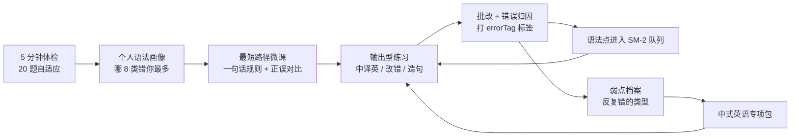

# 初学者英语语法快速上手 · 产品功能方案

更新时间：2026-09-12
适用产品：听写工坊（local-first 词句训练工具）新增「语法」能力模块

> **⚠️ 体验层已被取代**：本方案的「刷题式」体验设计（微课卡 → 做题 → 批改 → 复习）已由 `GRAMMAR_ADVENTURE_PLAN.md`（V2 语法冒险）取代。
> 本方案中仍然有效的部分：**第 1 章问题定义、第 5 章语法体系（6 个 Stage）、第 7.2 数据模型、第 7.3 三层判定引擎、第 8 章内容生产流水线**——它们是 V2 的底层底座，请配套阅读。

---

## 0. 结论先行

把市面上 30+ 个产品 / 开源项目拆完之后，可以下一个明确判断：

**语法学习的市场不缺「讲解」，也不缺「题库」，缺的是「从你自己的输出出发、把语法点练到自动化」的闭环。**

所以这个功能不应该是「又一个语法课程 App」，而应该是：

> 一个**错误驱动**的个人语法训练系统：先用 5 分钟体检定位你在中文母语负迁移上最容易犯的错，再用「中文提示 → 你写英文 → 即时批改 → 错误归因到语法点 → 间隔复习」把语法练成肌肉记忆。

四条设计原则（这是「少走弯路」的全部依据）：

| 原则 | 反例（大多数产品） | 我们的做法 |
| --- | --- | --- |
| **先骨架后细节** | 从「名词的分类」开始，学两周还在背术语 | 第一天就搭出「主 + 谓 + (宾/表)」骨架，先能造对简单句 |
| **错误驱动，不是知识驱动** | 按教材目录线性讲 500 个知识点 | 按「你实际错的类型」推送，只学你现在会用的 |
| **输出优先** | 看讲解 + 做选择题 | 中译英 / 造句为主，选择题只作为入场 |
| **复用间隔重复** | 学完就忘，回头复习没有抓手 | 语法点进入现有 SM-2 队列，和单词卡同一套引擎 |

首版不追求「学完英语语法」，而是追求：**两周内让初学者能用正确的简单句完成日常表达，并知道自己还会错什么。**

---

## 1. 问题定义：初学者学语法为什么低效

语法不是学不会，是**路径错了**。初学者的断裂点有五个，每一个都对应一个产品机会：

| 断裂点 | 具体表现 | 产品机会 |
| --- | --- | --- |
| ① 不知道学什么、什么顺序 | 打开一本语法书是从「冠词」到「虚拟语气」800 页，第一天就放弃 | 给出**最小可用路径**（6 个 Stage，约 30 个知识点），并按体检结果砍掉已经会的 |
| ② 规则记不住 | 「现在完成时表示过去发生的动作对现在造成的影响」——记住了也不会用 | 每个知识点压成**一句话规则 + 公式 + 3 组正误对比**，可背诵、可回忆 |
| ③ 学了不会用 | 选择题全对，一写作文就是 "I have 20 year old" | **输出型训练**（中译英、造句）作为主线题型 |
| ④ 中文负迁移反复犯 | 中文没有时态、没有三单、没有冠词、没有单复数标记，所以这几类错误占比最高 | **中式英语专项包**：按中国学习者错误频率排序，逐条打掉 |
| ⑤ 没有反馈和归因 | 老师只划红线，不知道这是「时态问题」还是「词性问题」 | **错误标签 → 归因到语法点 → 进入复习队列**，错误变成学习任务 |

第 ④ 点值得单独强调。多项对中国英语学习者写作错误的研究显示，高频错误高度集中：

- **时态误用**（尤其过去时、现在完成时）——中文是「时态缺失语言」，动词不变化，所以这是最难根除的一类；
- **主谓一致**（三单漏 -s）——占写作语法错误约 1/3；
- **冠词缺失 / 误用**——占基础错误约 18%；
- **名词单复数**（不可数名词加 -s，如 `advices`、`informations`）——约占 25%；
- **介词误用**、**be 动词缺失**（`She happy.`）、**句子成分残缺**（`Because rainy, cancel trip.`）、**粘连句**（`I like English it is useful.`）。

这 8 类几乎覆盖了初学者 80% 的实际错误。**针对性地打掉这 8 类，比学完 800 页语法书有效得多**——这就是「少走弯路」的具体含义。

---

## 2. 竞品调研

### 2.1 上线产品：四种做法

| 类型 | 代表产品 | 他们怎么做的 | 优势 | 弱点 / 我们的机会 |
| --- | --- | --- | --- | --- |
| **练习型** | British Council LearnEnglish Grammar、English Grammar in Use（Murphy）、Grammaropolis、Johnny Grammar's Word Challenge、慧语法、Practice English Grammar | 知识点 → 讲解 → 选择题/填空题 → 正确率统计。LearnEnglish 覆盖 25 个 topic、1000+ 题、4 个 CEFR 级别、10 种题型；Grammaropolis 把词性做成拟人角色配动画歌曲；Johnny Grammar 是限时抢答 + 排行榜 | 内容权威、结构清晰、题型丰富 | 全部是**选择题/填空题为主**，几乎没有「你自己写一句，我告诉你错在哪」。做题正确率 ≠ 会用 |
| **纠错工具型** | Grammarly、QuillBot、LanguageTool | 输入任意文本 → 检测错误 → 高亮 + 修改建议 + 解释 | 即时反馈、真实语境 | 无教学体系，不告诉你「你反复犯的是同一类错」；面向写作者而非初学者 |
| **课程型** | 有道领世（24 模块体系）、新概念、赖世雄、旋元佑《语法俱乐部》、B 站/YouTube 语法课 | 老师讲 + 例题 + 真题演练 + 错题总结；有道领世还做了分层班型（<90 / 90-110 / >110）和 AI 语法检测 | 体系完整、讲解深入、有老师答疑 | 依赖人的时间，重、慢、贵；被动听课的留存差 |
| **平台型** | Duolingo、Busuu、Talkpal、ELSA Speak、Memrise、Anki | Duolingo 用「翻译句子」隐式教语法，不讲规则 + 强游戏化；ELSA 检测口语中的语法错误；Memrise/Anki 用间隔重复 + 助记 | 留存机制强、学习成本低 | Duolingo 到 B1 就上不去（不讲清规则）；Anki 只有工具没有内容 |

### 2.2 开源项目：可直接借鉴的 7 个

| 项目 | 技术栈 / License | 它做了什么 | 可借鉴点 |
| --- | --- | --- | --- |
| **LanguageTool** | Java，LGPL 2.1+，31 语言，可自托管 REST API | 规则引擎：分词 → 词性标注 → 依存分析 → 匹配 XML 规则。核心理念是「规则描述**错误长什么样**」 | 规则引擎分层架构；错误模式（pattern）的表达方式；自托管思路 |
| **English-Structure / Grammar Handbook** | 纯静态 + JSON，无构建依赖 | 每个 topic 结构固定：`summary / rules / examples / commonMistakes[{wrong, correct, explanation}] / quiz`，支持 CEFR 分级 + 本地笔记 | **内容数据结构可以直接参考**；`commonMistakes` 字段设计极佳 |
| **GrammarLab** (sythang) | Next.js + Supabase + OpenAI，MIT | 产品原则写得很清楚：**micro-chunking / active recall / contrastive examples / error-driven review / real-life contexts**；数据表 `mistake_events(concept_tag)` → 「Practice weak spots」 | **这是最接近我们思路的项目**：错误打 concept_tag、再按弱点推荐练习 |
| **Tense Playground** | Next.js 16 + React 19 + Tailwind + Gemini，MIT | 12 时态 Playground；Sentence Analyzer 会标注 subject / verb / object / auxiliaries；拖拽造句、单词雨、AI 助教、streak/badge/XP | **句子成分分析器**的交互；游戏化激励设计 |
| **Grammagic** | Laravel + Livewire + GPT-4o-mini | 21 天课程计划：Markdown 课程 → 开放式问答 → GPT 评分反馈 → 渐进解锁 → streak | 「21 天节奏」的课程容器；**AI 给开放式输出打分**的可行范式 |
| **Gramio** | PHP + vanilla JS | 题库 JSON 极简：`{sentence, answer, hint}`；错题自动记录可重练；游客模式用 localStorage | **填空题库的最小数据结构** + 错题重练机制 |
| **Zanichelli english-grammar-multiple-choice-generation** | LLM 微调，CC-BY 4.0 | 用 LLM 批量生成 19 个语法主题的多选题（题干 + 答案 + 干扰项），并用「结构合规率 + SELF-BLEU 去重」做自动评估，人工校验后约 85% 合规 | **内容批量生产 + 质量指标的流水线**，直接可抄 |

辅助技术组件：

- **spaCy + displaCy / displacy.js**（MIT）：成熟的依存句法树 SVG 可视化，可服务端出 JSON、前端渲染，用于「句子拆解器」。
- **compromise**（JS，MIT）：轻量级浏览器端词性标注 / 时态识别，无需后端，适合本地优先架构。
- **HuggingFace `English-Mini` / `LLM English 100MB`** 数据集：A1–B2 的 `instruction → input → output` + `rule` 四元组（如 `tense_past`、`article_usage`、`subject_verb_agreement`），是**错误驱动训练**的理想数据范式。
- **CEFR 结构化题库仓库**（language-learning-dataset-structured）：按 A1–B2 组织 `fill_in_the_blanks / sentence_order / listening` 等分题型 JSON。

### 2.3 竞品结论：四个空白点

1. **没有面向中文母语者的负迁移专项。** 国外产品（British Council、Grammaropolis、Duolingo）不会告诉你「中文没有三单，所以你会漏 -s」。
2. **没有「从我的输出出发」的归因闭环。** 题库型产品给你一批固定题；Grammarly 给你一次性修改；都没有把「你又犯了同一类错」变成任务。
3. **语法没有被间隔重复化。** 除了 Anki（要靠自己造卡），主流产品的语法学习都是「学完即止」。
4. **语法与词汇 / 听力 / 输出是割裂的。** 用户要在 4 个 App 之间跳。

而听写工坊已经具备三件别人没有的东西：**本地优先的数据主权、成熟的 diff 批改服务、可复用的 SM-2 复习引擎**。语法模块不是从零造，而是把这三件资产接到一个新的错误类型上。

一句话定位：

> **别人的语法产品教你规则；我们的语法产品纠正你，并且记住你会错什么。**

---

## 3. 产品定位与信息架构

### 3.1 定位

> 面向中文母语初学者（CEFR A1–A2，零基础到能说简单句）的**错误驱动语法训练模块**：5 分钟体检 → 最短路径微课 → 输出型练习 → 错误归因 → 间隔复习 → 弱点复现。

### 3.2 在现有产品中的位置

新增一级导航「**语法**」，归入现有「训练台」分组。页面清单：

| 路由 | 页面 | 说明 |
| --- | --- | --- |
| `/grammar` | 语法地图 | 6 个 Stage 的知识点地图 + 掌握度热力图 + 今日语法任务入口 |
| `/grammar/checkup` | 入门体检 | 20 题自适应诊断，产出个人语法画像 |
| `/grammar/topic/:id` | 知识点详情 | 微课卡（一句话规则 / 公式 / 正误对比 / 中式提醒）+ 练习入口 |
| `/grammar/practice/:topicId` | 专项训练 | 题型轮换练习，含中译英 + diff 批改 |
| `/grammar/weak` | 弱点档案 | 错误类型分布、反复错的语法点、周报 |
| `/grammar/legacy` | 中式英语专项 | Top 30 负迁移清单，逐条攻克 |
| `/grammar/diagram` | 句子拆解器 | 输入任意句子 → 主干 + 成分可视化 |

现有页面只改两处：`src/App.tsx` 增加路由与导航项；`TodayPage` 增加「今日语法 10 分钟」任务卡（可与单词、听写任务并列或折叠）。

---

## 4. 核心闭环



这个闭环和现有产品的「听写 → 错词 → 复习」是**同一个形状**，只是把训练对象从「听辨」换成「语法输出」。技术上可以复用同一套调度、批改、统计服务。

---

## 5. 语法知识体系：初学者最短路径

这是「少走弯路」的核心资产。**不从教材目录出发，从「能造对句子」出发。**

### 5.1 六个 Stage

| Stage | 名称 | 目标 | 知识点 | 建议时长 |
| --- | --- | --- | --- | --- |
| **S0** | 句子骨架 | 知道英语句子必须有什么 | 5 大基本句型、be 动词、there be、主语不能省略 | 1 天 |
| **S1** | 名词与限定 | 名词能站住 | 可数/不可数、单复数、a/an/the/零冠词、代词、this/that、some/any/many/much | 2–3 天 |
| **S2** | 谓语动词（核心） | 时间说清楚 | 一般现在（含三单 -s）、一般过去、现在进行、将来（will / be going to）、现在完成（入门用法）、时态一致性 | 1–2 周 |
| **S3** | 修饰与扩展 | 句子有细节 | 形容词/副词及位置、比较级最高级、介词（in/on/at 的时间与地点）、语序 | 3–4 天 |
| **S4** | 句子变长 | 能表达复杂意思 | 并列与连接词（and/but/because/so，注意 because…so 不能连用）、不定式与动名词基础、定语从句 who/which/that、宾语从句 that | 1–2 周 |
| **S5** | 特殊与语用（按需） | 表达更地道 | 情态动词 can/must/should、被动语态入门、if 条件句入门、口语高频句型 | 按需 |

设计要点：

- **S0 必须第一天做。** `She happy.` / `Because rainy, cancel trip.` 这类错误全部来自骨架缺失，不解决骨架，后面全是空转。
- **S2 是重投入区。** 时态是中国学习者最难的一类，要允许「反复回到 S2」。
- **S5 默认折叠。** 初学阶段不教虚拟语气、倒装、独立主格——这些是「学多了反而拖慢上手」的典型。
- 每个 Stage 之间不做硬门槛，但体检结果会决定推荐顺序（已掌握的直接跳过）。

### 5.2 知识点卡片结构（统一 6 字段）

每个知识点都用这一个模板，保证「可背诵、可对比、可练习」：

```json
{
  "id": "third-person-s",
  "stage": "S2",
  "title": "一般现在时的第三人称单数",
  "oneLineRule": "主语是 he/she/it 或单个事物时，动词要加 -s。",
  "structure": "S(he/she/it) + V-s/es",
  "whenToUse": "说习惯、事实、规律时；主语是第三人称单数。",
  "contrasts": [
    { "wrong": "She go to school every day.", "correct": "She goes to school every day.", "explanation": "主语 She 是三单，go 要变 goes。" },
    { "wrong": "My mother like reading.", "correct": "My mother likes reading.", "explanation": "My mother = she，同样要加 -s。" },
    { "wrong": "He don't know.", "correct": "He doesn't know.", "explanation": "否定用 doesn't，此时动词恢复原形。" }
  ],
  "negativeTransfer": "中文动词不随人称变化（「他去 / 我去」都是「去」），所以你会本能地漏掉 -s。",
  "exercises": ["choose", "fill", "correct", "translate"],
  "prerequisites": ["basic-sentence-pattern", "be-verb"]
}
```

结构全部落在一个 JSON 文件里（参考 English-Structure 的 `levels/level-N.json` 做法），前端懒加载，便于后续增删。

---

## 6. 功能模块设计

### F1 · 语法地图 + 入门体检（入口）

**语法地图**：6 个 Stage 横向排列，每个知识点是一张卡片，颜色表示掌握度（灰=未学、黄=在学、绿=已掌握、红=反复错）。点击进入微课；红色的卡片自动排到队列前面。

**入门体检**：20 道自适应题（5 分钟），题型混合（判断句对错 / 选择 / 极短中译英）。不是考试，是**分层**：

- 每答对一组，下一题跳到更难的 Stage；答错则向下探底。
- 产出画像：「你的时态 40 分、冠词 30 分、主谓一致 50 分、句子骨架 85 分」。
- 直接给出**最短路径**：「你只需要补 S0 的 1 个点 + S1 的 3 个点 + S2 的 5 个点，就可以开始写正确句子」。这句话是留存的关键。

### F2 · 微课卡（90 秒一个知识点）

单卡信息密度极高，一屏讲完：

1. 一句话规则（大字，可背诵）
2. 结构公式（`S + V-s/es`）
3. 什么时候用（配时间轴图示，时态类知识点必配）
4. 正误对比 ×3（红/绿对照，这是最有效的记忆单元）
5. 中式思维提醒（一句话，直击母语干扰）
6. 「练 5 题」按钮 → 进入专项训练

不做长视频、不做章节式课程。**目标是 90 秒能消化一个知识点。**

### F3 · 错误驱动训练（核心功能）

这是整个模块的心脏，流程：

1. 给一个**中文句子 + 使用场景**（如「我昨天去了公园」）
2. 用户输入英文
3. 提交后展示：
   - 词级 diff（复用现有 `diffService`）
   - **语法错误标签**（见下表），在错处下方用彩色标签标出
   - 一句话解释「为什么错」+ 对应语法点链接
   - 「加入语法复习队列」按钮（默认自动加入）
4. 同一语法点会在后续 2 天内以不同题型再出现 2–3 次（换句子、换场景）

错误标签体系（与「中式英语 Top 8」一一对应）：

| errorTag | 说明 | 示例 |
| --- | --- | --- |
| `missing_be` | 缺 be 动词 | `She happy.` → `She is happy.` |
| `sv_agreement` | 主谓一致（三单） | `He go.` → `He goes.` |
| `tense` | 时态误用 / 不一致 | `Yesterday I go.` → `Yesterday I went.` |
| `article` | 冠词缺失 / 误用 | `He is honest boy.` → `He is an honest boy.` |
| `plural` | 单复数 / 可数性 | `three book` → `three books`；`advices` → `advice` |
| `preposition` | 介词误用 | `I live at China.` → `I live in China.` |
| `fragment` | 句子成分残缺 | `Because rainy, cancel trip.` |
| `run_on` | 粘连句 / 连接词误用 | `I like English it is useful.`；`Because…, so…` |
| `word_order` | 语序 | `a book interesting` → `an interesting book` |
| `verb_form` | 非谓语 / 动词形式 | `was sing` → `was sung` |

标签的作用不只是展示——它是**归因键**：`grammarProfile` 按 tag 累计错误次数，直接驱动「弱点档案」和复习优先级。

### F4 · 语法点专项队列（复用 SM-2）

进入现有 `reviewService`，题型按难度轮换：

```
改错句（最简单） → 填空（四选一） → 填空（自己写） → 中译英（短句） → 造句（自由）
```

- 复习间隔沿用现有算法（当天 / D+1 / D+3 / D+7 / D+14 / D+30）。
- 「忘记」→ 降级并插回当天队列；「熟练」→ 间隔拉长。
- 一个知识点只有在**输出型题型（中译英 / 造句）连续两次通过**才算「已掌握」，选择题全对不算。

### F5 · 句子拆解器（看懂句子的能力）

输入任意英文句子 → 可视化输出：

- **括号法**：`[The man in the blue shirt] [is] [my teacher].` 主干加粗，修饰语灰色
- **树状图**：依存句法树（可参考 spaCy displaCy 的 SVG 形式），鼠标悬停显示成分名
- **一句话总结**：「这句话的主干是 The man is my teacher，in the blue shirt 是用来修饰 man 的」

用途：初学者最大的挫败感来自「长句看不懂」。拆解器把长句还原成骨架，让阅读和语法互相加强。这也是唯一需要后端（或可选本地模型）的功能，可放在 P2。

### F6 · 中式英语专项包（差异化最强）

按中国学习者错误频率排序的 Top 30 清单，每条包含：错误表达 → 正确表达 → 为什么 → 一句话口诀 → 3 道即时练习。

覆盖：三单漏 -s、时态跳变、冠词、单复数、be 动词缺失、介词搭配、`because…so` 连用、`very like`、`I very like it` → `I like it very much`、`open the light` → `turn on the light`、`people mountain people sea` 类直译、`How to say…` → `How do you say…` 等。

这个模块国外产品做不了，是我们的护城河。

### F7 · 弱点档案与周报

- **错误类型分布**：环形图，时态 / 冠词 / 主谓一致 / 介词 / 单复数各占比多少
- **反复错的语法点 Top 5**：按错误次数排序，一键「重练」
- **趋势**：本周输出题正确率 vs 上周；重复错误率是否下降
- **每周一句话结论**：「你这周冠词错误从 12 次降到 4 次，但时态错误仍然占 60%，建议重练 S2 的 3 个知识点。」

### F8 · 今日 10 分钟（与主流程合流）

在现有 `TodayPage` 加一张卡：**1 分钟微课 + 6 题练习 + 错题复习**。默认开启，可在设置里关闭。设计上不抢占听写主流程——语法是「可选但推荐」的每日任务，而非强制的第二个打卡。

### F9 · AI 语法教练（复用现有 AI 配置）

复用 `aiHttpClient` / `modelService` / `SettingsPage` 的 AI Provider 配置，做三件事：

1. 批改开放输出（中译英长句、自由造句、作文片段）
2. 解释「为什么错」的自然语言版本（规则引擎给结论，AI 给讲解）
3. 按知识点即时生成新练习变体，避免内容库枯竭

**降级策略**：未配置 AI 时，全部退回规则引擎 + 本地词性分析，功能可用只是讲解简略。

### F10 · 输出自检清单

写作 / 口语前的 8 条 checklist，把语法变成可执行动作：

```
□ 每句都有主语和谓语吗？（防 fragment）
□ 三单主语，动词加 -s 了吗？
□ 时间是过去，动词变形了吗？全文时态一致吗？
□ 可数名词单数前有 a/an/the 吗？
□ 不可数名词加 -s 了吗？（information / advice / homework）
□ because 和 so 同时用了吗？
□ 形容词放在名词前面了吗？
□ 介词搭配是背过的那个吗？
```

可打印 / 可悬浮，是「学语法」到「用语法」的最后一公里。

---

## 7. 技术实现方案

### 7.1 与现有架构的衔接

现有技术栈：React 18 + TypeScript + Vite + Tauri 2 + `localStorage`（预留 SQLite 迁移），服务层集中在 `src/services/`。

新增文件（尽量不侵入现有代码）：

```
src/
  types.ts                        # 追加语法相关类型（不改动已有类型）
  data/
    grammarTopics.ts              # 知识点内容（按 Stage 分组，懒加载）
    grammarLegacy.ts              # 中式英语 Top 30
    grammarCheckup.ts             # 体检题库
  services/
    grammarService.ts             # 知识点查询、掌握度、推荐队列
    grammarCheckService.ts        # 语法批改 + 错误归因（规则 → 本地模型 → LLM）
    grammarProfileService.ts      # 画像、错误统计、周报
    grammarDiagramService.ts      # 句子拆解（P2）
  pages/
    GrammarPage.tsx               # 地图
    GrammarCheckupPage.tsx        # 体检
    GrammarTopicPage.tsx          # 微课卡
    GrammarPracticePage.tsx       # 专项训练
    GrammarWeakPage.tsx           # 弱点档案
    GrammarLegacyPage.tsx         # 中式英语专项
  components/
    GrammarMicroLesson.tsx
    GrammarErrorBadge.tsx         # 错误标签 + 解释气泡
    SentenceDiagram.tsx           # 拆解器
```

复用（零改动或极小改动）：`diffService.ts`（词级对齐）、`reviewService.ts`（SM-2 调度）、`storage.ts`（持久化）、`aiHttpClient.ts` / `modelService.ts`（AI）、`statsService.ts`（统计图表）、`SpeakButton.tsx`（例句发音）、`AppContext.tsx`（数据装载）。

### 7.2 数据模型（接入现有 `AppData`）

```ts
// 追加到 AppData
interface AppData {
  // ...现有字段保持不变
  grammarTopics: GrammarTopic[];          // 内置内容（随版本升级覆盖）
  grammarAttempts: GrammarAttempt[];      // 练习记录（用户数据）
  grammarProfiles: GrammarProfile[];      // 每知识点的掌握度与错误统计
  grammarCards: GrammarCard[];            // 用户自己收集的"我常错的句子"
}

interface GrammarTopic {
  id: string;
  stage: "S0" | "S1" | "S2" | "S3" | "S4" | "S5";
  order: number;
  title: string;
  oneLineRule: string;
  structure: string;
  whenToUse: string;
  contrasts: { wrong: string; correct: string; explanation: string }[];
  negativeTransfer: string;
  prerequisites: string[];
  tags: string[];
}

interface GrammarExercise {
  id: string;
  topicId: string;
  type: "choose" | "fill" | "correct" | "translate" | "arrange" | "compose";
  prompt: string;            // 中文提示 / 题干
  context?: string;          // 场景提示
  answer: string;
  options?: string[];        // choose 类型
  explanation: string;
  errorTags: string[];       // 该题主要考察的错误类型
}

interface GrammarAttempt {
  id: string;
  exerciseId: string;
  topicId: string;
  type: GrammarExercise["type"];
  userAnswer: string;
  expected: string;
  isCorrect: boolean;
  errorTags: string[];       // 归因结果
  durationMs: number;
  createdAt: string;
}

interface GrammarProfile {
  topicId: string;
  mastery: number;                             // 0-100
  practiceCount: number;
  outputPassCount: number;                     // 输出型题型连续通过次数
  errorCounts: Record<string, number>;         // errorTag -> 次数
  lastPracticedAt: string;
}
```

复习调度：复用现有 `Schedule`（`cardId` 字段存 `topicId` 即可），仅需给 `reviewService` 增加一个「按 errorTag 加权」的优先级函数：某个 tag 的累计错误次数越多，对应知识点排得越靠前。

### 7.3 语法判定引擎：三层降级（关键工程决策）

和现有 `diffService`（规则优先、可解释、零成本）保持同一哲学，**永远先给确定性结论，再让 AI 补充解释**。

| 层 | 技术 | 负责 | 成本 | 何时用 |
| --- | --- | --- | --- | --- |
| **L1 规则层** | 正则 + 词表 + 现有 diff | 8 类高频负迁移错误、拼写、单复数、冠词 a/an、三单、be 缺失、because…so | 0 | 永远先跑 |
| **L2 本地模型层** | `compromise`（JS, MIT）做词性标注 / 时态识别 / 句子成分；可选 `wink-nlp` | 动词形式、词性误用、语序、简单从句识别 | 0（离线） | L1 无结论时 |
| **L3 LLM 层** | 复用现有 AI Provider | 开放输出批改、自然语言讲解、练习生成 | 按量 | 开放题 / L1+L2 不确定时 |

L1 规则示例（可直接落地）：

```ts
// 三单漏 -s
/\b(he|she|it|this|that)\s+(go|like|have|do|want|need|work|live|come|make|take)\b/i
// 元音前该用 an
/\ba\s+[aeiou]/i
// 过去时间状语 + 动词原形
/(yesterday|last\s+\w+|ago)\b[^.]*\b(go|come|see|do|have|take|make|eat)\b/i
// because ... so 连用
/because\b[^.]*\bso\b/i
// be 动词缺失（主语 + 形容词，无 be）
/\b(he|she|it|i|they|we)\s+(very\s+)?(happy|tired|ready|busy|hungry|sad)\b/i
// 不可数名词加 -s
/\b(advices|informations|homesworks|furnitures|equipments|knowledges)\b/i
```

这套规则不需要 NLP 模型就能覆盖初学者 80% 的错误，且每一条都能给出「为什么」——这是建立用户信任的前提（对比：LLM 会编，规则不会）。

### 7.4 句子拆解器实现（P2）

- **服务端（可选）**：spaCy / Stanza 输出依存句法 JSON → 前端用 displacy.js 风格渲染 SVG。
- **纯前端方案**：`compromise` 提取主谓宾 + 简单短语识别，画「括号法」视图（实现成本低、准确度够用于教学），不做完整依存树。
- 建议先做纯前端括号法，验证需求后再上服务端依存树。

---

## 8. 内容生产方案（决定成败的环节）

语法产品的天花板是内容质量，不是代码。方案：

### 8.1 选题来源（不自创体系）

1. CEFR A1–A2 语法大纲（Describing language: CEFR companion volume）
2. Cambridge《English Grammar in Use》的单元目录结构（作为「什么算一个知识点」的粒度参考）
3. 中国义务教育英语课程标准「语法项目表」
4. 现有中文错误研究（前述 8 类高频错误）→ 决定每张卡片的 `negativeTransfer` 字段

### 8.2 生成流水线

```
选题清单（人工定 30 个知识点）
  → LLM 按 6 字段模板生成知识点卡片 + 每点 12 道题
  → JSON Schema 校验（zod）：字段完整性、答案唯一性、干扰项不重复
  → 自动质量检查：SELF-BLEU 去重、选项长度均衡、正确答案位置打散
  → 人工抽检 20%（重点看 negativeTransfer 和 explanation 是否准确）
  → 入库
```

质量指标参考 Zanichelli 的做法：**结构合规率 ≥ 95%、题目重复率 ≤ 5%**。

### 8.3 首批内容规模（1 周可完成）

| 内容 | 数量 | 备注 |
| --- | --- | --- |
| 知识点卡片 | 12–15 个 | 覆盖 S0（3）+ S1（4）+ S2（6） |
| 每点练习题 | 12 道 | 题型混合，其中输出型 ≥ 3 道 |
| 体检题库 | 20 道 | 自适应分层用 |
| 中式英语清单 | 30 条 | 独立于知识点，可先用现成研究结果整理 |

12 个知识点 × 12 题 = 144 题，就足以跑通完整闭环。**不要一开始做 500 个知识点。**

---

## 9. 交互与视觉

沿用现有设计语言（安静、工具型、桌面优先、中性色为主）：

- **正确/错误配色**：遵循本项目既有约定，正确用绿色、错误用红色，播放/进行中用蓝色；错误标签用不同色系区分类型（时态=蓝紫、冠词=橙、主谓一致=青、介词=粉）。
- **微课卡**：单卡单屏，规则用大字号，正误对比用双栏红绿对照。
- **练习页**：上方中文提示 + 场景，中间输入框，提交后输入框下方展开 diff + 错误标签 + 解释。
- **地图页**：横向 Stage 轨道，知识点为圆角卡片，颜色即状态，一眼看清「还要走多远」。
- **句子拆解器**：主干加粗黑、修饰语灰、连接词蓝，鼠标悬停显示成分名。
- 所有页面在移动端可用，但内容重、编辑型的操作（拆解器、弱点档案）以桌面为主。

---

## 10. 迭代路线

| 阶段 | 目标 | 交付物 | 验证指标 |
| --- | --- | --- | --- |
| **P0（1 周）** | 跑通最小闭环 | 语法地图 + 微课卡（12 个知识点）+ 选择/填空/改错三类题 + 复用复习队列 + 错误标签（L1 规则） | 自己每天用 10 分钟，连续 5 天；知识点首次通过率 > 60% |
| **P1（1–2 周）** | 输出型训练 | 中译英 + diff 批改 + 错误归因到 grammarProfile + 弱点档案 + 中式英语 Top 30 | 输出题占比 > 40%；重复错误率周环比下降 |
| **P2（2–3 周）** | 看懂句子 + AI 加持 | 句子拆解器（括号法）+ AI 语法教练 + 今日任务合流 + 周报 | 每日语法任务完成率 > 50%；AI 批改人工抽检准确率 > 85% |
| **P3（按需）** | 自适应与口语 | 自适应体检、基于 errorTag 的智能推荐、口语语法检查（接现有 `pronunciationService`） | D7 留存、语法点掌握率 |

**先做什么的判据**：P0 必须能独立回答「我今天该学哪个点、学完对不对」。如果 P0 做不出闭环，后面全是堆功能。

---

## 11. 指标体系

**北极星指标**：每周完成的**输出型**语法题数（中译英 + 造句）。选它的理由：只有输出才算真的会用；选择题可以靠蒙。

**核心漏斗**：

```
进入语法页 → 完成体检 → 完成第一个微课 → 完成首次练习 → 次日复习 → 加入日常
```

**产品指标**：

- 体检 → 首次练习转化率（目标 > 50%）
- 知识点首次通过率（目标 60–75%，太高说明太简单）
- 输出型题占比（目标 > 40%）
- 重复错误率周环比下降（核心健康度指标，目标 −30%/月）
- 语法任务连续完成天数
- D1 / D7 留存

**质量指标**：

- 批改准确率（人工抽检 100 题，目标 > 90%）
- 误报率（把对的判成错，目标 < 5%，这是最伤信任的）
- 每知识点题目重复率 < 5%

---

## 12. 风险与对策

| 风险 | 影响 | 对策 |
| --- | --- | --- |
| **批改误判** | 用户不信任，直接弃用 | 规则优先保证可解释；每条错误都能点开看「为什么」；提供「忽略此提示」；误报率作为一等指标监控 |
| **内容量做不完** | 功能空壳 | 首批只做 12 个知识点的最小闭环，宁少勿滥；后续用 LLM 流水线扩量 |
| **语法学太多反而拖慢上手** | 违背「快速上手」初衷 | 主动限制范围：S5 默认折叠；知识点卡片强制「一句话规则」；拒绝长视频和章节式课程 |
| **和主产品打架** | 用户只想用听写 | 语法入口不抢主流程；今日任务里语法是可选卡片，可关闭 |
| **LLM 成本** | 长期不可持续 | L1 规则层覆盖 80% 场景；LLM 只用于开放题和讲解；复用用户自己的 API Key |
| **与词汇学习重复** | 用户困惑 | 明确分工：词汇卡背「怎么拼怎么写」，语法卡背「怎么造对句子」；一个句子可以同时拆出单词卡和语法点 |
| **拆解器准确度不足** | 教错结构 | 先做括号法（主干 + 修饰词），不做完整依存树；不确定时显式提示「仅供参考」 |

---

## 13. 一句话总结

不要做「第 100 个语法课程 App」。做**中文母语初学者的语法体检 + 错误纠正 + 间隔复习**：用 6 个 Stage 的最短路径替代 800 页语法书，用「你写我改」替代「我看我懂」，用现有 SM-2 引擎把语法练成习惯。

这条路的技术门槛不高（大部分是内容 + 规则），但需要克制——**克制住把语法讲全的冲动，只教初学者现在就会用到的部分。**

---

## 14. 参考资料

**上线产品**

- British Council LearnEnglish Grammar：<https://learnenglish.britishcouncil.org/apps/learnenglish-grammar>
- English Grammar in Use（Cambridge / Raymond Murphy）：<https://www.cambridge.org/gb/cambridgeenglish/catalog/grammar-vocabulary-and-pronunciation/english-grammar-use-5th-edition>
- Grammaropolis：<https://grammaropolis.com/>
- Grammarly：<https://www.grammarly.com/>
- Duolingo：<https://www.duolingo.com/>
- ELSA Speak：<https://elsaspeak.com/>
- 有道领世高中英语语法体系（24 模块）：<http://5574.peixun360.com/news/802662>
- 百词斩语法板块：<https://www.baicizhan.com/>

**开源项目**

- LanguageTool：<https://github.com/languagetool-org/languagetool>
- English-Structure / Grammar Handbook：<https://github.com/mahdiahmadi1991/English-Structure>
- GrammarLab：<https://github.com/sythang/grammarLab>
- Tense Playground：<https://github.com/dharam-gfx/tense-playground>
- Grammagic：<https://github.com/fatemeh-shahrabi/grammagic>
- Gramio：<https://github.com/t7jk/gramio>
- Zanichelli 语法多选题生成：<https://github.com/ZanichelliEditore/english-grammar-multiple-choice-generation>
- CEFR 结构化题库数据集：<https://github.com/nezahatkorkmaz/language-learning-dataset-structured>

**技术组件**

- spaCy + displaCy 依存句法可视化：<https://spacy.io/usage/visualizers>
- compromise（JS 词性标注）：<https://github.com/spencermountain/compromise>
- English-Mini / LLM English 教学语料数据集：<https://huggingface.co/datasets/Gugu8/English-Mini>

**错误研究**

- Ungrammatical Patterns in Chinese EFL Learners' Freewriting：<https://files.eric.ed.gov/fulltext/EJ1075686.pdf>
- 中国英语学习者语际错误按 CEFR 分类：<https://www.skola.co.uk/zh/single-post/中国英语学习者常犯的语际错误>
- 中高考英语作文最常见错误分析：<https://www.toutiao.com/article/7511711063365222964>
