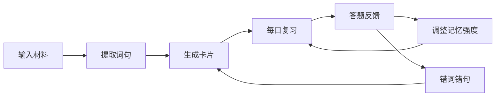
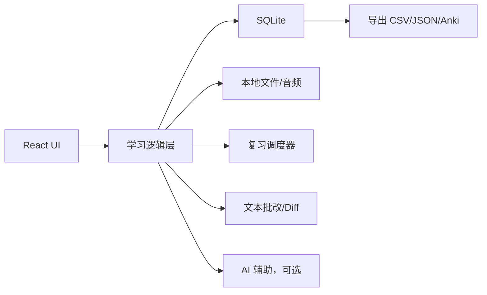

# 个人自用背单词产品方案

更新时间：2026-06-17

## 1. 产品定位

这是一个面向个人长期英语积累的背单词工具，不追求社交、排行榜、课程售卖和公开内容库。它的核心目标是让你把每天遇到的英文材料转化成可复习的单词、短语和句子，并通过听、看、拼、默写、回译等方式真正记住。

一句话定位：

> 一个围绕“真实语境”的个人单词记忆系统：从文章、字幕、听写、手动摘录中收集词句，自动生成复习任务，并把错误持续回流成下一轮训练。

核心理念：

- 不只背单词释义，要背单词在句子里的用法。
- 不只刷卡片，要把错词、错句、听写错误变成复习材料。
- 不追求每天大量新词，优先保证复习闭环稳定。
- 所有数据可导出，避免被工具锁死。

## 2. 目标用户与使用场景

目标用户就是你自己：

- 有持续学习英语的需求。
- 想背单词，也想积累句子。
- 会从阅读、听力、视频、课程里遇到生词。
- 希望工具帮你安排复习，而不是只做一个收藏夹。
- 可能会结合听写、精听、默写、回译来训练。

主要场景：

1. 阅读文章时遇到生词，快速加入单词本。
2. 看视频/字幕时遇到好句，加入句子本。
3. 听写时拼错、漏听某个词，自动加入错词本。
4. 每天打开工具，按系统安排完成复习。
5. 周末回顾这一周反复忘的词和句子。

## 3. 产品核心闭环



完整闭环：

1. 输入：手动添加、粘贴文章、导入字幕、听写错误。
2. 提取：标记生词、短语、好句、错句。
3. 制卡：生成单词卡、短语卡、句子卡。
4. 复习：按间隔复习算法安排今日任务。
5. 反馈：根据记忆结果更新熟悉度。
6. 回流：错词和错句自动加入更高频复习。
7. 沉淀：形成自己的个人语料库。

## 4. 信息架构

首版页面建议：

- `/today`：今日学习台
- `/words`：单词本
- `/phrases`：短语本
- `/sentences`：句子本
- `/import`：导入材料
- `/review`：复习训练
- `/dictation`：听写练习，可后置
- `/library`：材料库
- `/stats`：学习统计
- `/settings`：设置与导出

导航优先级：

1. 今日
2. 复习
3. 添加
4. 单词
5. 句子
6. 统计

## 5. 核心对象设计

### 5.1 单词卡 Word Card

字段：

- 单词：`abandon`
- 音标：`/əˈbændən/`
- 美音/英音音频
- 中文释义
- 英文释义
- 词性
- 常见搭配
- 词根词缀
- 近义词/反义词
- 易混词
- 来源句子
- 自己的备注
- 标签
- 熟悉度
- 下次复习时间

单词卡不只是一个词典条目，而是一个记忆对象。最重要的是“来源句子”和“自己为什么加入它”。

### 5.2 短语卡 Phrase Card

字段：

- 短语：`come up with`
- 中文含义
- 英文解释
- 使用场景
- 例句
- 可替换表达
- 来源
- 标签
- 下次复习时间

短语卡适合记录固定搭配、介词短语、动词短语、口语表达。

### 5.3 句子卡 Sentence Card

字段：

- 英文句子
- 中文翻译
- 来源材料
- 音频片段，可选
- 关键词
- 句型结构
- 值得背的原因
- 难度
- 标签
- 复习模式
- 下次复习时间

句子卡是这个产品区别于普通背单词软件的关键。单词最后要回到句子里，句子才是表达能力的最小可用单位。

### 5.4 材料 Material

字段：

- 标题
- 类型：文章、字幕、音频、手动笔记
- 原文
- 字幕/分句
- 来源链接
- 导入时间
- 已提取单词数
- 已提取句子数
- 标签

材料库负责保存上下文，避免单词和句子变成孤立碎片。

## 6. 产品功能设计

### 6.1 今日学习台

这是打开产品后的第一屏。

展示内容：

- 今日待复习单词数
- 今日待复习短语数
- 今日待复习句子数
- 今日建议新词数
- 当前连续学习天数
- 复习负债提醒

核心按钮：

- 开始今日复习
- 添加新词
- 导入材料
- 继续昨天未完成

推荐默认任务：

- 新词：10 个
- 复习词：30 个
- 句子：5 个
- 默写/听写：5 句

如果当天时间少，可以进入“快速模式”：

- 只复习到期项目
- 跳过新词
- 每张卡只做一次判断

### 6.2 添加单词

添加方式：

1. 手动输入单词。
2. 粘贴一句话，选中生词加入。
3. 从导入文章中点击加入。
4. 从听写错误中自动加入。

添加后的自动动作：

- 查询释义、音标、发音。
- 生成简洁英文解释。
- 提取当前句子作为来源例句。
- 如果单词已存在，追加新例句，而不是重复建卡。
- 根据词频和历史错误设置初始难度。

手动编辑项：

- 只保留当前语境下最重要的释义。
- 写一句自己的理解。
- 标记“必须掌握”或“只是见过”。

### 6.3 添加句子

添加方式：

1. 手动粘贴英文句子。
2. 从文章中划选句子。
3. 从字幕中收藏当前句。
4. 从听写错误中加入错句。

句子处理：

- 自动翻译。
- 自动提取关键词。
- 自动识别短语和搭配。
- 自动生成遮挡版本。
- 可生成中文提示用于回译。

句子卡复习模式：

- 看英文想中文。
- 看中文回译英文。
- 遮挡关键词填空。
- 整句默写。
- 听音频写句子。
- 跟读复述。

### 6.4 导入材料

首版支持：

- 粘贴文章。
- 导入 `.txt`。
- 导入 `.srt` / `.vtt` 字幕。
- 手动创建材料。

后续支持：

- 上传音频并绑定字幕。
- ASR 自动转写。
- 浏览器插件一键收藏网页句子。

导入后的工作台：

- 左侧显示原文。
- 右侧显示候选生词和句子。
- 点击单词可加入单词本。
- 点击句子可加入句子本。
- 支持批量加入，但默认不鼓励一次加太多。

导入原则：

- 一篇材料最多建议加入 10-20 个词。
- 优先加入反复出现、有表达价值、影响理解的词。
- 句子只收藏真正值得背的，不把所有句子都变成负担。

### 6.5 复习训练

复习训练是产品最重要的体验。

单词复习模式：

1. 识别：看英文，想中文。
2. 回忆：看中文，想英文。
3. 拼写：听发音或看中文，拼出英文。
4. 语境：在句子中补全单词。
5. 易混：从相似词中选择正确词。

句子复习模式：

1. 看英文，理解意思。
2. 看中文，回译英文。
3. 关键词挖空。
4. 整句默写。
5. 听写整句。

答题反馈：

- 忘记
- 模糊
- 记得
- 熟练

反馈会影响下一次复习时间：

| 反馈 | 处理 |
| --- | --- |
| 忘记 | 10 分钟后再出现，复习阶段降级 |
| 模糊 | 明天再复习 |
| 记得 | 间隔扩大 |
| 熟练 | 大幅扩大间隔 |

### 6.6 错词与错句回流

任何训练中的错误都要进入回流系统。

单词错误来源：

- 拼写错。
- 看中文想不出英文。
- 听写漏词。
- 同义词混淆。
- 句子回译时用错。

句子错误来源：

- 听写整句失败。
- 回译句子失败。
- 关键词挖空失败。
- 句型结构理解错误。

回流规则：

- 第一次错：提高复习频率。
- 连续两次错：加入重点列表。
- 连续三次错：生成专项训练卡，例如拼写卡、搭配卡、听写卡。
- 掌握后自动退出重点列表，但保留历史记录。

### 6.7 搜索与个人语料库

搜索能力：

- 搜单词。
- 搜短语。
- 搜句子。
- 搜中文释义。
- 搜来源材料。
- 搜标签。

个人语料库视图：

- 一个单词出现过的所有句子。
- 一个短语出现过的所有材料。
- 某个标签下的词句，例如“工作邮件”“雅思口语”“播客”。
- 最近一周新增但还没掌握的词。

这个功能能让工具从“复习软件”变成“自己的英语数据库”。

### 6.8 统计与复盘

首版只做有用统计，不做花哨图表。

核心统计：

- 今日完成量。
- 到期复习量。
- 新增单词数。
- 已掌握单词数。
- 反复错误单词。
- 反复错误句子。
- 平均每日复习时长。
- 复习负债。

每周复盘：

- 本周新增了哪些词。
- 本周真正掌握了哪些词。
- 哪些词错了 3 次以上。
- 哪些句子值得重新默写。

## 7. 交互设计

### 7.1 今日页

页面结构：

- 顶部：今天日期、连续天数、完成进度。
- 主区：今日任务卡片。
- 底部：开始复习、添加新词、导入材料。

任务卡片：

- 单词复习：`30`
- 新词学习：`10`
- 句子复习：`5`
- 听写训练：`5`

交互原则：

- 打开后 3 秒内知道今天该做什么。
- 默认只给一个主按钮：开始今日复习。
- 不在首页塞太多统计，避免分心。

### 7.2 复习页

页面结构：

- 顶部：进度、当前模式、退出按钮。
- 中间：卡片内容。
- 底部：反馈按钮。

单词卡第一面：

- 英文单词
- 发音按钮
- 来源句子可折叠

点击“显示答案”后：

- 中文释义
- 英文释义
- 来源句子
- 常见搭配
- 自己的备注

反馈按钮：

- 忘记
- 模糊
- 记得
- 熟练

快捷键：

- 空格：显示答案/下一步
- 1：忘记
- 2：模糊
- 3：记得
- 4：熟练
- A：播放发音
- E：编辑卡片
- S：收藏/重点

### 7.3 拼写训练页

流程：

1. 显示中文释义或播放发音。
2. 输入英文。
3. 提交后展示 diff。
4. 错误字母高亮。
5. 错词进入更高频复习。

交互细节：

- 大小写默认不严格。
- 美式/英式拼写可配置。
- 可以忽略连字符和空格，也可以开启严格模式。

### 7.4 句子默写页

模式一：中文回译英文。

- 显示中文提示。
- 输入英文句子。
- 提交后按词 diff。
- 标记漏词、多词、替换、拼写错。

模式二：关键词挖空。

- 展示英文句子，但隐藏关键词。
- 输入缺失部分。
- 更适合复习短语和搭配。

模式三：听写句子。

- 播放句子音频。
- 输入听到的内容。
- 提交后按词对比。

### 7.5 导入工作台

页面结构：

- 左侧：原文/字幕句子列表。
- 右侧：待加入卡片列表。
- 顶部：导入设置。

交互：

- 点击单词：弹出快速添加面板。
- 选中短语：加入短语卡。
- 点击句子星标：加入句子卡。
- 批量处理候选生词。
- 已存在的词显示“已收录”，避免重复。

## 8. 完整使用流程闭环

### 8.1 每日流程，10-30 分钟

1. 打开今日页。
2. 点击“开始今日复习”。
3. 先复习到期单词。
4. 再复习到期句子。
5. 完成少量拼写或句子默写。
6. 系统记录错误。
7. 错词错句进入后续复习。
8. 如果还有时间，新增 5-10 个词或 1-3 个句子。

每天的重点不是新增多少，而是把到期复习清掉。

### 8.2 新材料学习流程

1. 粘贴一篇文章或导入字幕。
2. 系统自动拆句。
3. 你快速浏览材料。
4. 只选择真正需要掌握的词和句子。
5. 系统生成单词卡、短语卡、句子卡。
6. 当天只学习少量新卡。
7. 剩余新卡进入“待学习队列”。

这样可以避免一次导入太多，造成复习爆炸。

### 8.3 听写回流流程

1. 进入听写页。
2. 播放一句音频。
3. 输入听到的句子。
4. 系统按词批改。
5. 漏听词加入错词候选。
6. 整句加入错句候选。
7. 你确认后加入单词本/句子本。
8. 第二天复习这些错词和错句。

### 8.4 周复盘流程

1. 打开统计页。
2. 查看本周新增词和掌握词。
3. 查看错误次数最多的 10 个词。
4. 查看最常失败的 5 个句子。
5. 对这些内容做专项训练。
6. 删除不值得继续背的卡片。
7. 调整下周每日新词数量。

## 9. 复习算法

第一版建议使用简化版 SM-2，不需要过度复杂。

每张卡维护：

- `ease_factor`：难度系数，默认 2.5。
- `interval_days`：当前间隔。
- `review_count`：复习次数。
- `lapse_count`：忘记次数。
- `next_review_at`：下次复习时间。

反馈映射：

| 反馈 | 分数 | 下次间隔 |
| --- | --- | --- |
| 忘记 | 1 | 10 分钟后或明天 |
| 模糊 | 2 | 1 天 |
| 记得 | 3 | 当前间隔 * ease_factor |
| 熟练 | 4 | 当前间隔 * ease_factor * 1.3 |

自用建议：

- 新词第一天至少出现 2 次。
- 连续忘记的词不要一直硬刷，改成句子语境复习。
- 句子卡间隔可以比单词卡更长，但错句要更频繁。

## 10. 技术架构

### 10.1 推荐架构

自用版推荐“本地优先 + 可选云同步”。

首版最省心方案：

- 前端：Next.js + React + TypeScript
- UI：Tailwind CSS + shadcn/ui
- 本地数据库：SQLite
- ORM：Drizzle ORM 或 Prisma
- 音频：HTMLAudioElement
- 桌面化可选：Tauri
- AI 可选：OpenAI API 或本地模型
- 导出：CSV、JSON、Anki CSV、Markdown

为什么推荐本地优先：

- 自用数据不需要一开始上云。
- 没有登录、支付、权限系统负担。
- 成本低。
- 数据更可控。
- 后续可以再加云同步。

### 10.2 系统架构



### 10.3 模块拆分

前端模块：

- 今日学习台
- 卡片管理
- 复习训练
- 导入工作台
- 听写训练
- 统计复盘
- 设置导出

核心服务：

- `cardService`：创建、更新、查询卡片
- `reviewService`：计算到期复习、更新间隔
- `importService`：解析文本、字幕、材料
- `dictionaryService`：查询词典和发音
- `diffService`：单词/句子答案比对
- `statsService`：统计学习记录
- `exportService`：导出数据

### 10.4 数据模型

```sql
cards (
  id text primary key,
  type text not null, -- word, phrase, sentence
  front text not null,
  back text not null,
  note text,
  source_id text,
  tags text,
  status text not null, -- new, learning, review, mastered, suspended
  created_at datetime,
  updated_at datetime
)

word_details (
  card_id text primary key,
  word text not null,
  phonetic text,
  part_of_speech text,
  chinese_definition text,
  english_definition text,
  collocations text,
  synonyms text,
  antonyms text,
  confused_words text,
  audio_url text
)

sentence_details (
  card_id text primary key,
  sentence text not null,
  translation text,
  keywords text,
  grammar_note text,
  audio_url text,
  start_ms integer,
  end_ms integer
)

materials (
  id text primary key,
  title text not null,
  type text not null, -- text, subtitle, audio
  content text,
  source_url text,
  file_path text,
  tags text,
  created_at datetime
)

reviews (
  id text primary key,
  card_id text not null,
  mode text not null, -- recognize, recall, spelling, cloze, dictation
  rating integer not null, -- 1-4
  answer text,
  diff_json text,
  reviewed_at datetime
)

schedules (
  card_id text primary key,
  ease_factor real not null,
  interval_days real not null,
  review_count integer not null,
  lapse_count integer not null,
  next_review_at datetime not null
)
```

## 11. MVP 开发顺序

第一阶段：能背起来

1. 创建项目和本地 SQLite。
2. 做今日页。
3. 做单词卡 CRUD。
4. 做句子卡 CRUD。
5. 做最简单的复习队列。
6. 做四级反馈：忘记、模糊、记得、熟练。
7. 保存复习记录。

第二阶段：能从材料收词

1. 粘贴文本导入。
2. 自动拆句。
3. 选词加入单词本。
4. 选句加入句子本。
5. 已存在词合并来源例句。

第三阶段：能练拼写和句子

1. 拼写训练。
2. 中文回译英文。
3. 关键词挖空。
4. 词级 diff。
5. 错词错句回流。

第四阶段：更适合长期使用

1. 标签和搜索。
2. 每周复盘。
3. CSV/JSON/Anki 导出。
4. 音频和字幕听写。
5. AI 释义、例句、句法分析。

## 12. 首版取舍

必须做：

- 单词卡
- 句子卡
- 今日复习
- 间隔复习
- 拼写训练
- 句子默写
- 文本导入
- 数据导出

可以后做：

- ASR 自动转写
- 云同步
- 移动端 App
- 发音评分
- 浏览器插件
- 复杂统计图表

不建议做：

- 排行榜
- 社交打卡
- 公开课程
- 教师端
- 会员系统
- 大而全内容库

## 13. 最推荐的个人使用方式

每天：

- 先清到期复习。
- 新增不超过 10 个单词。
- 新增不超过 3 个句子。
- 至少做 5 个拼写或句子默写。

每周：

- 复盘高频错误。
- 删除不值得背的卡。
- 把反复忘的单词改成句子复习。
- 从一篇真实材料里补充新词句。

长期：

- 单词是入口。
- 句子是核心。
- 听写是检验。
- 错误是下一轮学习材料。

