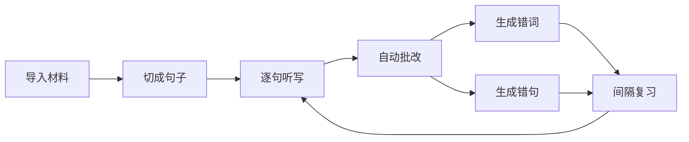
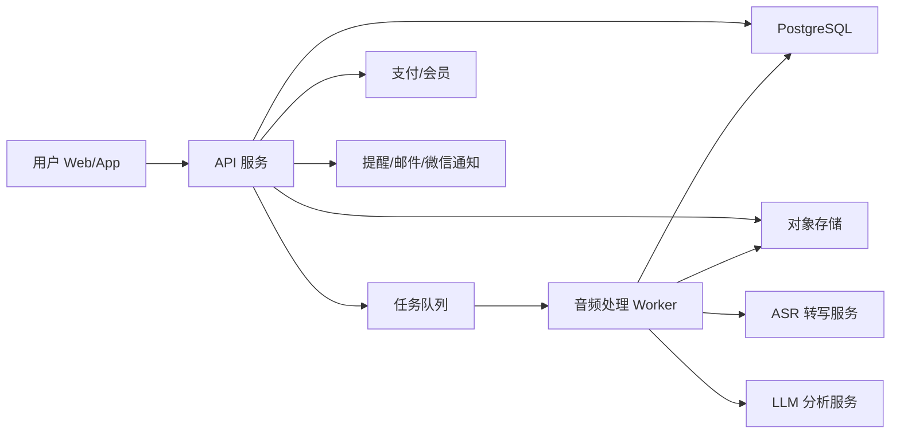
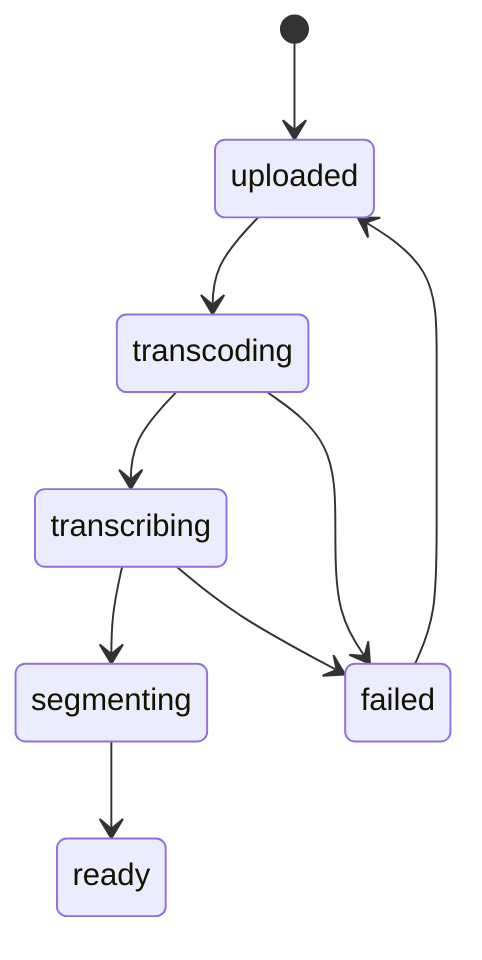

# 英语听写与背诵工具产品方案

更新时间：2026-06-17

## 0. 自用版优化结论

如果这个工具主要给自己用，方案需要从“商业化英语听写平台”收敛成“个人英语输入训练系统”。核心不再是市场增长、教师端、会员和大内容库，而是每天稳定完成三个动作：

1. **背单词**：把阅读、听写、字幕里遇到的词自动沉淀成可复习的单词卡。
2. **背句子**：把好句、错句、长难句沉淀成句子卡，支持默写、听写、遮挡、复述。
3. **听写复习**：用音频句子反复训练听辨，听写错误自动回流到单词本和句子本。

自用版的产品闭环：



第一版应优先做本地可用、低成本、数据可导出，而不是登录、支付、分享和老师作业。

自用版优先级：

| 优先级 | 功能 | 原因 |
| --- | --- | --- |
| P0 | 单词卡、句子卡、复习队列、听写批改 | 每天必须用到，决定工具是否有价值 |
| P1 | 音频/字幕导入、逐句听写、错词错句自动沉淀 | 把听力材料变成长期记忆材料 |
| P2 | AI 解释、例句生成、TTS、难度标记 | 提升效率，但不是第一天必须 |
| P3 | ASR、云同步、多端、统计报表 | 有用，但可以等核心习惯跑通 |
| 暂缓 | 商业化、教师端、公开内容库、增长策略 | 自用阶段不需要 |

## 1. 产品定位

建议产品名暂定为「听写工坊」。自用版核心定位不是做一个面向市场的大而全英语学习 App，而是做一个面向个人长期积累的“单词 + 句子 + 听写”训练工具。

一句话定位：

> 一个可以把英语音频、字幕、文章中的单词和句子沉淀成复习卡片，并通过听写、默写、遮挡和间隔复习帮助自己长期记住的英语训练工具。

自用版目标：

1. 每天背一定数量的新词和复习词。
2. 每天积累、默写和听写一批真实句子。
3. 把听写里错过的词、短语、句型自动加入复习。
4. 形成自己的语料库，而不是依赖平台内容流。

首发差异化：

- 爱听写类产品偏雅思机考与在线听写，内容和考试场景强。
- 每日英语听力、扇贝听力口语偏大内容库、多训练方式、泛听与口语。
- 背单词产品偏词汇记忆，句子和听写通常不是主线。
- 自用版机会是把“背单词、背句子、听写错题”合成一个个人知识库。

## 2. 市场与机会判断

### 2.1 市场背景

在线教育整体仍然是大市场。公开行业资料显示，2024 年中国在线教育市场规模已突破 5800 亿元，用户规模约 4.8 亿，职业教育、素质教育、AI 教学系统、订阅制服务都在增长。英语学习虽然是成熟赛道，但“听力精听”仍然有明显痛点：练习过程枯燥、反馈慢、材料整理成本高、错因复盘弱。

雅思官方 2024-2025 中国大陆报告显示，雅思在留学之外也越来越多被用于求职和职业发展；考生备考策略正在从“盲目刷题”转向“模考、诊断、复盘”的闭环。虽然报告强调口语是职业发展中最受重视的能力，但听力仍是语言输入的基础，而且听写天然适合做可量化训练。

### 2.2 用户痛点

| 痛点 | 表现 | 产品机会 |
| --- | --- | --- |
| 材料准备成本高 | 找音频、字幕、切句、整理答案非常耗时 | 支持链接/文件/文本导入，自动转写、切句、生成练习 |
| 听写反馈不精确 | 只告诉对错，不知道漏听、拼写、连读、弱读哪里错 | 按词级 diff、错因标签、相似音/漏词提示 |
| 复习弱 | 今天错过的句子明天很难再遇到 | 错句本、错词本、间隔复习、听写日历 |
| 练习体验割裂 | 播放器、字幕、笔记、词典分散在不同工具 | 单页完成听、写、查、改、复盘 |
| 老师布置麻烦 | 作业靠微信群、表格统计 | 班级、作业、完成率、错题热力图 |
| 大 App 太重 | 内容多但路径复杂，想练 15 分钟很难进入状态 | 极简训练流：打开素材，逐句听写，完成复盘 |

### 2.3 切入策略

首发不要和每日英语听力、扇贝正面拼“海量内容库”。内容版权、编辑成本、渠道品牌都很重。更好的切入口是：

1. **工具优先**：用户导入自己的音频、视频、字幕、文本。
2. **考试场景做模板**：雅思 Part 1-4、四六级短对话/长篇、考研英语听力训练包。
3. **AI 提效**：自动转写、自动切句、自动批改、自动生成错因。
4. **复习留存**：错句和错词变成第二天的学习任务。
5. **教师端变现**：个人用户验证后，扩展到班级作业和机构版。

## 3. 竞品调研

### 3.1 主要竞品

| 产品 | 核心定位 | 主要功能 | 优势 | 弱点/机会 |
| --- | --- | --- | --- | --- |
| 爱听写 iDictation | 雅思机考、剑桥真题、在线听写 | 雅思机考模拟、剑桥真题、自动批改、自定义词书、错词复习、精听训练 | 考试场景明确，听写功能直接 | 更偏固定内容和雅思场景，用户自带素材与 AI 个性化可继续增强 |
| ListenMemo | 英语听写与听力训练 | 听写练习、智能复习、雅思/托福备考 | 产品聚焦、路径轻 | 品牌和内容生态弱，可通过更强导入、批改和教师端差异化 |
| 每日英语听力 | 综合听力学习平台 | 海量内容库、FM、单句循环、听写、测验、8 档语速、离线下载、跟读打分、上传资源 | 内容壁垒强，多端成熟，用户量大 | 功能较重，听写只是多模式之一，深度错因和班级作业不是主卖点 |
| 扇贝听力口语 | 听说训练 App | 12w+ 真实语料、单句切分、盲听、选词填空、拼写练习、倍速、AI 跟读评分、音素纠错 | 内容丰富，AI 口语强，打卡体系成熟 | 偏 App 内容平台，个人导入与专项听写工具空间仍在 |
| 羊驼雅思 | 雅思备考综合工具 | 剑雅题库、精听泛听、影子跟读、AI 评分、机经、课程 | 雅思垂直强，考试资料齐 | 更像备考平台，不是通用听写工具 |
| 不背单词/墨墨/百词斩 | 词汇记忆 | 单词复习、拼写、例句、听力/听写辅助 | 复习算法、词库、习惯养成强 | 不解决长句听写、音频切句、材料导入 |

### 3.2 竞品结论

现有产品分成三类：

1. 内容平台：每日英语听力、扇贝，胜在资源和多端。
2. 考试平台：爱听写、羊驼雅思，胜在真题和考试路径。
3. 记忆平台：墨墨、不背单词、百词斩，胜在复习算法和词库。

我们的差异化应落在“听写生产力工具 + 精听训练闭环”：

- 不追求一开始拥有最大内容库。
- 让用户 1 分钟把自己的材料变成听写题。
- 把每一次错听沉淀成可复习、可统计、可教学的数据。
- 支持个人学习和教师布置两个场景。

## 4. 自用版产品功能方案

### 4.1 MVP 功能

MVP 目标：自己能录入或导入单词和句子，完成每日复习；能导入一段带字幕的音频，逐句听写后把错词、错句自动加入复习。

核心模块：

1. 今日学习台
   - 今日新词
   - 今日复习词
   - 今日句子
   - 今日听写
   - 复习完成进度、连续学习天数

2. 单词本
   - 手动添加单词、音标、释义、例句、备注
   - 从句子和听写错误中一键加入单词
   - 标记熟悉度：陌生、认识、熟练、已掌握
   - 支持拼写默写、看英文想中文、看中文想英文、听音辨词
   - 支持标签：雅思、工作、口语、影视、阅读、生词

3. 句子本
   - 手动添加句子、翻译、来源、备注
   - 从字幕、文章、听写错句中加入句子
   - 支持句子默写、听写、遮挡关键词、整句复述
   - 支持标记句型、短语、搭配、语法点
   - 支持收藏“值得背”的表达

4. 素材导入
   - 粘贴文本：自动拆分句子，提取候选单词
   - 上传字幕：srt、vtt、lrc、txt
   - 上传音频：mp3、m4a、wav
   - 第一版优先支持“音频 + 字幕”，暂不强依赖 ASR

5. 听写练习
   - 逐句播放
   - 快捷键：播放/暂停、上一句、下一句、重播、显示答案
   - 变速：0.5x、0.75x、1x、1.25x、1.5x
   - 循环：当前句循环、AB 循环、整段播放
   - 输入框支持大小写宽容、标点宽容、自动保存草稿

6. 自动批改
   - 按词比对：正确、漏词、多词、拼写错、顺序错
   - 标点、大小写、缩写可配置
   - 相似拼写容错：Levenshtein 距离
   - 同音/近音提示：例如 their/there、to/too/two
   - 错词可一键加入单词本，错句可一键加入句子本

7. 间隔复习
   - 每张单词卡和句子卡都有下一次复习时间
   - 默认复习间隔：当天、D+1、D+3、D+7、D+14、D+30
   - 根据答题结果调整间隔：忘记则降级，轻松答对则升级
   - 支持“今天只复习 20 分钟”的限时模式

8. 导入导出
   - CSV/JSON 导出单词、句子、复习记录
   - 支持 Anki CSV 导出，避免数据被锁死
   - 本地备份优先，云同步后置

### 4.2 V1 增强功能

1. AI 单词助手
   - 自动生成简明中文释义、英文释义、例句、常见搭配
   - 自动识别词根词缀、近义词、反义词、易混词
   - 根据自己的句子语境解释词义，避免只背词典第一义

2. AI 句子助手
   - 分析句子结构
   - 提取值得背的短语和句型
   - 生成中文提示，用于回译默写
   - 改写成更口语或更正式的表达

3. AI 错因分析
   - 解释为什么容易错：弱读、连读、爆破、词汇不熟、语法结构长。
   - 给出训练建议：慢速听、遮盖部分答案、跟读复述。

4. 跟读与影子练习
   - 录音跟读
   - 发音评分
   - 语速、停顿、重音对比

5. 题型模板
   - 全文听写
   - 挖空听写
   - 首字母提示
   - 选词填空
   - 英译中、中译英
   - 句子重组

6. 个人语料库
   - 按来源管理：播客、视频、文章、课程、考试材料
   - 搜索单词出现在哪些句子里
   - 查看某个单词的所有真实语境
   - 给材料打标签和难度

教师端、公开内容库和商业化不进入自用版 V1。

### 4.3 V2 可选增强

1. 多端同步
   - 桌面端管理材料
   - 手机端碎片化复习
   - 数据云同步和自动备份

2. ASR 自动转写
   - 无字幕音频自动转成句子
   - 自动生成听写素材
   - 适合播客、YouTube、课程录音

3. 个人学习分析
   - 哪些词反复忘
   - 哪些句型最薄弱
   - 听写准确率趋势
   - 每周学习时间和复习负债

4. Anki/Obsidian 联动
   - 导出 Anki 卡片
   - 导出 Markdown 笔记
   - 每个句子保留来源和音频片段

## 5. 用户体验流程

### 5.1 新用户首日流程

1. 选择学习目标：雅思/托福/四六级/泛听提升/自定义。
2. 选择导入方式：上传音频、上传字幕、粘贴文本、使用示例素材。
3. 系统处理素材：转写、切句、生成练习。
4. 用户完成 5 句听写。
5. 系统展示报告：正确率、漏听词、推荐复习。
6. 引导保存错句本并设置明日提醒。

首日成功指标：

- 3 分钟内进入第一句听写。
- 首次练习完成率 > 60%。
- 完成后保存错句本比例 > 40%。

### 5.2 核心练习页

页面结构：

- 顶部：素材标题、进度、总分、设置。
- 中间：音频波形/句子播放条、当前句序号。
- 主区：输入框、答案对比、错误标签。
- 右侧或底部：句子列表、错词、笔记、词典。
- 底部：播放控制、速度、循环、提交、下一句。

关键交互：

- 默认不显示答案，提交后显示 diff。
- 答案可“逐词揭示”，避免用户一次看到全文。
- 错误词点击可查词、发音、加入错词本。
- 重听次数自动记录，用于难度评估。

## 6. 技术实现方案

### 6.1 推荐技术栈

前端：

- Web 首发：Next.js + React + TypeScript
- UI：Tailwind CSS + shadcn/ui 或 Radix UI
- 状态：Zustand 或 TanStack Query
- 音频：HTMLAudioElement + Web Audio API + wavesurfer.js
- 编辑器：普通 textarea 起步，后续可用 CodeMirror 做词级标注

后端：

- API：Node.js/NestJS 或 Python/FastAPI
- 数据库：PostgreSQL
- 缓存/队列：Redis + BullMQ / Celery
- 对象存储：S3/R2/阿里 OSS/腾讯 COS
- 搜索：Postgres full-text 起步，后续 Meilisearch/Elasticsearch

AI 与音频：

- ASR：OpenAI Whisper/API、Azure Speech、阿里云智能语音、腾讯云 ASR 可按成本和合规选择
- TTS：OpenAI TTS、Azure Neural Voice、火山/阿里 TTS
- LLM：用于错因解释、难度评估、练习生成
- 音频处理：ffmpeg 做转码、切片、响度标准化

部署：

- Web：Vercel / Cloudflare Pages / 自建 Docker
- API：Docker + ECS/Render/Fly.io/阿里云
- 数据库：Supabase/RDS
- 文件：Cloudflare R2 或国内云 OSS
- 监控：Sentry + OpenTelemetry + PostHog/Umami

### 6.2 系统架构



### 6.3 核心数据模型

```sql
users (
  id, email, phone, nickname, avatar_url,
  target_exam, level, created_at, updated_at
)

materials (
  id, owner_id, title, source_type, source_url,
  audio_url, duration_ms, language, status,
  asr_provider, created_at, updated_at
)

segments (
  id, material_id, segment_index,
  start_ms, end_ms, text, normalized_text,
  word_count, difficulty_score, speech_rate,
  created_at, updated_at
)

practice_sessions (
  id, user_id, material_id, mode,
  started_at, finished_at, score,
  total_segments, completed_segments
)

practice_answers (
  id, session_id, segment_id,
  answer_text, normalized_answer,
  score, replay_count, hint_count,
  diff_json, submitted_at
)

mistake_items (
  id, user_id, source_type, source_id,
  word, phrase, segment_text, error_type,
  next_review_at, review_stage, mastered_at,
  created_at, updated_at
)

classes (
  id, owner_id, name, invite_code, created_at
)

assignments (
  id, class_id, material_id, title,
  due_at, settings_json, created_at
)
```

### 6.4 听写批改算法

第一版不必完全依赖大模型，建议用规则算法保证稳定、可解释、低成本。

流程：

1. 文本标准化
   - 小写化
   - 去除或弱化标点
   - 统一缩写：I am -> I'm 可配置
   - 数字归一：twenty one / 21 可配置
   - 去除多余空格

2. 分词
   - 英文按 token 分词
   - 保留缩写、连字符词
   - 可接入 compromise/natural 或 spaCy

3. 序列对齐
   - 使用 Needleman-Wunsch 或 diff-match-patch
   - 标出 matched、missing、extra、substitution

4. 拼写相似判断
   - Levenshtein 距离 <= 1 或编辑距离比例低于阈值，标记 spelling
   - 对高频易混词做白名单：their/there、whether/weather

5. 评分
   - 词级准确率 70%
   - 句子完整度 20%
   - 标点/大小写 10%，默认不强罚
   - 根据用户模式可开启“考试严格评分”

6. 反馈
   - 漏词：可能没听到弱读/连读。
   - 替换：可能词汇不熟或同音混淆。
   - 拼写：纳入错词本。
   - 多词：可能凭语感脑补。

### 6.5 ASR 与字幕处理

素材状态流转：



处理细节：

- 上传后统一转为 mp3/aac，采样率 16k 或 44.1k。
- 使用 ffmpeg 提取响度、时长、静音片段。
- 有字幕时优先用字幕；无字幕时走 ASR。
- ASR 输出 word timestamp 时可实现逐词高亮。
- 切句规则：最长 12-18 秒，优先按静音和标点切分。
- 用户可手动合并/拆分句子，编辑结果进入版本记录。

### 6.6 权限与版权

必须尽早设计版权边界：

- 用户上传素材默认仅个人可见。
- 公共素材必须确认可使用授权，避免直接搬运商业课程和真题音频。
- 分享练习链接时，只分享片段和练习，不公开源文件下载。
- 对教师/机构提供版权承诺入口：由上传者确认拥有使用权。
- 对涉嫌侵权内容提供举报和下架机制。

### 6.7 合规与隐私

- 登录、支付、学习记录属于个人信息，需隐私政策和用户协议。
- 音频可能包含个人声音，需提示上传者获得授权。
- 国内上线需 ICP 备案；如果有 App，还涉及应用市场合规。
- 未成年人场景需谨慎，先避免直接面向低龄用户做社交和排名。

## 7. 产品路线图

### 阶段 0：原型与验证，1-2 周

目标：验证“逐句听写 + 自动批改”是否顺手。

交付：

- Web 原型
- 示例素材 10 条
- 逐句播放器
- 输入与批改
- 错句本雏形

验证指标：

- 10 位目标用户访谈
- 单次练习完成率
- 用户是否愿意导入自己的材料

### 阶段 1：MVP，4-6 周

目标：可公开小范围测试。

交付：

- 用户登录
- 音频/字幕上传
- ASR 转写任务
- 自动切句
- 听写练习页
- 自动批改
- 错句/错词复习
- 学习报告

验证指标：

- 首次练习完成率 > 60%
- 次日回访率 > 25%
- 人均每周听写句数 > 50
- ASR 成本可控，单小时音频处理成本清晰

### 阶段 2：Beta，6-8 周

目标：打磨留存和付费。

交付：

- AI 错因分析
- 题型模板
- 分享练习
- 会员额度
- 微信/邮件提醒
- 管理后台

验证指标：

- D7 留存 > 15%
- 付费转化 > 3%
- AI 分析点击率 > 30%

### 阶段 3：教师端，8-12 周

目标：打开 B2B/B2B2C 增长。

交付：

- 班级
- 作业
- 学生报表
- 批量导入
- 机构套餐

验证指标：

- 10 位教师试用
- 每位教师创建 >= 2 个作业
- 学生作业完成率 > 50%

## 8. 商业模式

### 8.1 个人会员

免费版：

- 每月 30 分钟 ASR
- 20 条错句复习
- 基础批改
- 示例素材

Pro 版：建议 19-39 元/月，或 99-199 元/年

- 每月 300-600 分钟 ASR
- 无限错句/错词
- AI 错因分析
- 高级题型模板
- 导出 PDF/字幕/错词本

### 8.2 教师版

建议价格：

- 个人教师：99-199 元/月
- 小班机构：按学生数收费，例如 5-15 元/学生/月
- 机构私有化：定制报价

能力：

- 班级管理
- 作业布置
- 报表导出
- 批量素材处理
- 私有素材库

### 8.3 内容变现

- 雅思听写训练包
- 四六级新闻听写包
- 商务英语会议听写包
- 老师/创作者售卖素材包，平台抽成

## 9. 增长策略

首批获客渠道：

1. 小红书/抖音/B 站：关键词“雅思听力精听”“英语听写方法”“听力上不去怎么办”。
2. 英语老师和学习博主：提供素材包制作工具，换取内容分发。
3. SEO：英语听写、雅思听写、在线听写、听力精听、dictation practice。
4. 社群：雅思/四六级备考群，提供免费精听模板。
5. 产品内分享：用户可分享一套听写练习链接，接收者完成后注册保存结果。

内容策略：

- 每周发布“3 分钟听写挑战”。
- 发布典型错因短视频：连读、弱读、吞音、数字听写。
- 提供免费素材包：雅思租房场景、校园场景、地图场景。

## 10. 关键指标

北极星指标：

- 每周有效听写句数（Weekly Completed Dictation Segments）

核心漏斗：

1. 访问 -> 注册
2. 注册 -> 创建/选择素材
3. 素材 ready -> 开始第一句
4. 开始 -> 完成 5 句
5. 完成 -> 保存错句
6. 保存 -> 次日复习
7. 复习 -> 付费/分享

产品指标：

- 首次练习完成率
- 人均每周听写句数
- 人均重听次数
- 错句复习完成率
- D1/D7/D30 留存
- ASR 单用户成本
- 会员转化率

## 11. 开发拆分

### 11.1 前端任务

- 项目初始化：Next.js、TypeScript、Tailwind、组件库
- 登录页、素材列表页、素材详情页
- 上传组件：文件上传、进度、状态
- 听写练习页：播放器、句子导航、输入、提交
- Diff 展示组件
- 错句本和错词本
- 学习报告页
- 设置页：容错规则、播放偏好、目标考试

### 11.2 后端任务

- 用户认证与 session
- 素材 CRUD
- 文件上传签名 URL
- 音频处理任务队列
- ASR 服务封装
- 字幕解析与切句
- 批改服务
- 练习记录 API
- 错句/错词复习 API
- 会员额度与用量统计

### 11.3 AI/算法任务

- 文本归一化
- 词级 diff
- 错误类型分类
- 句子难度评分
- ASR 结果后处理
- AI 错因 prompt
- 间隔复习调度

### 11.4 运维任务

- 对象存储配置
- 队列与 Worker 部署
- 数据库备份
- 日志与监控
- 费用看板：ASR、LLM、存储、带宽
- 内容审核与举报后台

## 12. 风险与应对

| 风险 | 影响 | 应对 |
| --- | --- | --- |
| ASR 成本过高 | 免费用户成本失控 | 免费额度、转写排队、低价 ASR 供应商、多模型路由 |
| 版权风险 | 内容下架或法律风险 | 用户私有上传、公共素材授权、举报机制、避免盗用真题音频 |
| 批改不准 | 用户不信任产品 | 规则算法可解释，允许用户申诉/编辑答案 |
| 留存低 | 工具用完即走 | 错句复习、学习日历、每日挑战、教师作业 |
| 大厂竞品强 | 获客困难 | 专注导入和听写工具效率，做垂直口碑 |
| 音频处理复杂 | 开发周期拖长 | MVP 先支持音频+字幕上传，无字幕 ASR 作为异步增强 |

## 13. MVP 推荐实现顺序

1. 搭建 Web 项目和后端 API。
2. 做素材上传与列表。
3. 先支持上传字幕 + 音频，不依赖 ASR。
4. 做逐句播放器和听写输入。
5. 做文本归一化与 diff 批改。
6. 保存练习记录和错句。
7. 加入 ASR 异步转写。
8. 做学习报告和复习计划。
9. 加入会员额度。
10. 小范围用户测试。

这个顺序的好处是尽快验证核心体验，避免一开始被 ASR、版权、内容库拖慢。

## 14. 首版页面清单

- `/`：练习入口/素材列表，不做营销型大首页
- `/login`：登录
- `/materials`：素材库
- `/materials/new`：创建素材
- `/materials/:id`：素材详情、切句编辑
- `/practice/:sessionId`：听写练习
- `/review`：错句/错词复习
- `/reports`：学习报告
- `/settings`：播放、批改、账号设置
- `/admin`：后台，后期再做

## 15. 建议首版视觉方向

- 工具型、安静、专注，不做花哨教育营销风。
- 桌面端优先，移动端可练习但上传和编辑弱化。
- 颜色建议：中性灰/白为主，搭配绿色表示正确、红色表示错误、蓝色表示播放/进行中。
- 练习页要像“音频编辑器 + 输入工作台”，不是内容资讯流。
- 快捷键和播放控制要足够顺手，这是精听工具的核心质感。

## 16. 参考资料

- 爱听写 iDictation：<https://www.idictation.cn/>
- ListenMemo：<https://www.listenmemo.com/zh/>
- 每日英语听力官网：<https://www.eudic.net/v4/en/app/ting>
- 每日英语听力 Microsoft Store：<https://apps.microsoft.com/detail/9wzdncrfjxj8>
- 每日英语听力 Google Play：<https://play.google.com/store/apps/details?id=com.qianyan2.ting.en&hl=zh-cn>
- 扇贝听力：<https://www.shanbay.com/m/app/listen/>
- 扇贝听力口语 App Store：<https://apps.apple.com/ru/app/id897432803>
- 羊驼雅思：<https://winielts.com/>
- 不背单词：<https://bbdc.cn/>
- 墨墨背单词帮助：<https://www.maimemo.com/help30>
- 百词斩：<https://www.baicizhan.com/>
- 2024-2025 中国大陆雅思成绩大数据报告：<https://www.chinaielts.org/press-office/IELTS-%20Chinese-Mainland%20-Big-Data-Report-2024-2025>
- 中国在线教育行业资料参考：<https://m.chinabgao.com/freereport/111828.html>
