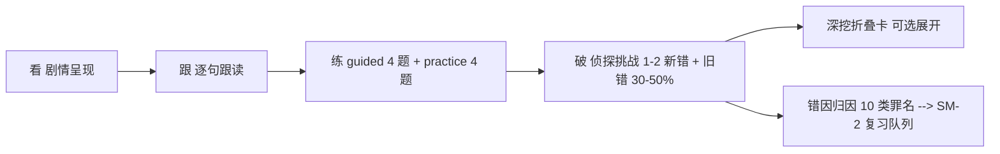
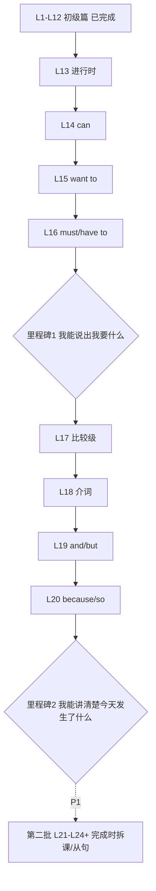

# 听写工坊 · 「小美的一天」第二季 —— 进阶语法教程 PRD

| 项目 | 内容 |
|---|---|
| 标题 | 进阶语法教程（第二季）：内容广度扩展 |
| 日期 | 2026-09-12 |
| 类型 | PRD（功能规格书） |
| 参与 | 析客（需求分析，执笔）· 瑞思（用户研究）· 竞析（竞品分析）· 数析（数据基线）· 方向明（方向裁决） |
| 前置文档 | 《听写工坊语法模块升级 PRD · 讲透/理解/复习/熟练掌握》（prd-grammar-mastery-2026-09-12.md）。该文档聚焦**单课深度闭环**（前测/对比揭示/产出型复习/确证仪式，R01–R15），其核心能力（课前测试、小结卡、SM-2 复习、弱点加权）据数析基线已落地。本 PRD 与其互补：**那边管"每课学得透"，这边管"走得更远"**。本文不重复其范围，仅复用其机制，不新增机制类需求。 |

---

## 📌 TL;DR

1. 用户反馈"12 课不完整"，瑞思实证真实诉求不是"课多"，而是**体系能托住用户走到下一个表达台阶**——从"报句子"走到"聊天和讲事情"（否定/疑问/复数人称 0 覆盖是缺口实锤）。
2. 方案：「小美的一天」**第二季进阶篇**，A2 收口，总规划 16–24 课，分两批各 8 课（P0/P1）。**形态零更换**：四段式 + 冒险叙事 + 零术语 + 单课 6–10 分钟。
3. 第一批 8 课全部落在现有 3 题型、10 类罪名可批改范围内，**零 schema 迁移**（数析实证：纯数据追加即可扩容），技术侧仅需 1 次小改（PathPage 分组标题）+ 封面资产 + 1 行 lesson_started 埋点。
4. 第一批估算 ≈ 4–5 人日（内容）+ 1–1.5 人日（技术）；第二批（含现在完成时拆课 + 对比课 + 从句入门）+ 1–1.5 人日；选修 P2 不做承诺。
5. 最大风险：难度跳跃与词汇墙随进阶回潮。以"中文映射最自然的 3 课起步 + 超纲词 ≤3–5/课配中文注释 + 螺旋混题（旧错 30–50%）"三道护栏对冲。

---

## 🎯 核心结论卡片

| 维度 | 结论 |
|---|---|
| 推荐方案 | 「小美的一天」第二季进阶篇：16–24 课分两批交付，第一批 8 课为 P0（进行时/情态/比较级/介词/连接词），第二批 P1（完成时拆 3–4 课 + 从句入门 + 语序），选修 P2（被动/虚拟）默认折叠 |
| 优先级 | P0（第一批 8 课 + PathPage 分组小改 + 封面资产 + lesson_started） |
| 预期影响 | 把体系覆盖从"报句子"延伸到"讲事情、说意愿、连句子"（can-do 里程碑：「我能讲清楚今天发生了什么」）；差异化延续"中级叙事沉浸 + 中文负迁移专项"两个竞品空档 |
| 资源需求 | 第一批 ≈ 4–5 人日内容 + 1–1.5 人日技术；第二批 ≈ 5–6 人日内容 + 0.5–1 人日技术；合计约 11–14 人日 |
| 风险等级 | 低（数据侧零迁移、题型/罪名零新增）；中风险仅剩"难度跳跃"与"词汇墙"，已有护栏缓解 |

---

## §1 产品目标

**G1 体系完整：把表达台阶从"报句子"延伸到"讲事情"**
第二季 16 课（两批）上线后，用户能覆盖叙事（进行时）、意愿能力（can/want to/must）、修饰与比较（形容词/比较级/介词）、句子连接（and/but/because/so）四类高频表达需求。
验收信号：第一批完课率 ≥60%；每课完课用户中 practice 无提示变体题一次通过率 ≥70%。

**G2 形态一致：进阶不等于换课型，老配方跑通新内容**
所有新课沿用四段式（看→跟→练→破）、零术语主线、单课 6–10 分钟、每课恰 1 个新语法增量。
验收信号：每课 guided 一次通过率不低于现有 12 课基线 −10pp；deep_dive_expanded 展开率与现有课持平或更高（说明"为什么"层被需要且可读）。

**G3 闭环延续：新知识进入既有复习与纠错机器**
每课 1–2 个新 huntCase（旧错混入 30–50%），新错因全部映射到现有 10 类罪名，进 SM-2 与弱点加权，学过不丢。
验收信号：第一批课程对应新案 hunt_verdict 破案率 ≥70%；新罪错因在 grammar_review_result 中的复习复发率与现有课案件持平（不显著劣化）。

---

## §2 用户故事

- **US-A（叙事）**：我想描述正在发生的事——"小美正在做饭"，用「正在」零成本映射现在进行时，讲清今天发生了什么（对应瑞思 US1）。
- **US-B（意愿与能力）**：我想在点餐/请假/求助场景说出"我能/我想/我必须"——can、want to、must 分课呈现，一次一个（US2）。
- **US-C（连接）**：我想用 and/but/because/so 把句子连成一段话，日记和对话不再全是断裂的单句（US3）。
- **US-D（世界变大）**：我想让小美继续她的故事，题材随我长大（职场/旅行/人情往来），案子混着旧知识考我——进阶感是"世界变大了"而不是"课本变厚了"（US4）。
- **US-E（节奏与兜底）**：每课仍 6–10 分钟、一次一个新东西；遇到没学过的词，有中文注释兜底，可以收进生词抽屉（US5）。

---

## §3 用户研究洞察（瑞思）

1. **"不完整"= 缺"能说的事"**：用户真实期待是"能用英语把日常生活说成一段话"。12 课止步于"报句子"，下一步表达需求高度可预测：讲事情 → 说想不想/能不能 → 把句子连起来。
2. **排序按表达需求，不按语法体系**：进行时（中文"在/正在"零成本映射）→ can/want to/must（点餐请假求助刚需）→ and/but/because/so 三座桥；比较级、介词次之；**现在完成时可推迟**（中文无对应概念、认知负担最大）；被动/虚拟最低。
3. **形态不能换**：用户已用三次决策投票认可现形态（接受 6–10 分钟不拆 24 课、深度方案 B 被否、趣味判据判据成立）。进阶 = "同一部连续剧的第二季"。
4. **三道护栏对冲三大回潮风险**：术语恐惧（深挖折叠卡已有解法）、难度跳跃（前 3 课选中文映射最自然的做缓冲坡）、词汇墙（新险：超纲词必须配中文注释、进生词抽屉、单课超纲词 ≤3–5 个）。
5. **趣味不被进阶牺牲**：题材走向职场/旅行/人情往来，拒绝低幼；趣味判据门禁——删掉某机制学习效果不变则不做。
6. **完整感靠 can-do 里程碑收口**（每 4–6 课一个），不做进度条焦虑。

---

## §4 竞品对比（竞析）

| 产品 | 分级/体量 | 进阶做法 | 对我们的启示 |
|---|---|---|---|
| Duolingo | Section 粗映射 CEFR，B1 各 50 单元；仅 22 个显式语法技能，其余藏进功能话题课；Stories 315 个 | 进阶靠体量堆叠 | **隐含语法配比**：进阶把新语法藏进点餐/旅行/聊天气等功能课，为续季课型配比参考 |
| Murphy 5th | 12 大类 145 双页单元；现在完成时拆 8 单元 | 难点多单元拆分 + 易混对比课 + 跨单元混合练习 | **现在完成时必须拆分 + 对比课**（have done → have been/gone → for/since → vs did） |
| British Council | 显式 CEFR 四段；每知识点前测→讲解→后测三段式；Teens 短剧与"小美"同构但止步 A2 | A1–A2 约 20+ 篇 | **前测模式我们已有自动生成，零成本复用**；A2 收口是主流合理选择 |
| Busuu | A1→B2，进阶缩水（A1 35 章 → B2 15 章）；Checkpoint 80% 跳章 | 课长 2–10 分钟 | 进阶缩水是行业通病，**单人小而精可行**；A2 收口体量 16–24 课合理 |
| Babbel | CEFR 分级，语法 tips 嵌入 + 独立 Grammar Guide | Review 官方明说用 SRS | 印证 SM-2 路线正确性 |
| 中文产品（百词斩等） | 语法附属板块，无分级叙事无输出型练习 | 讲解 + 题库 | 空档确认：中文母语者负迁移专项**无产品做** |
| 开源（GrammarLab / Tense Playground / Grammagic） | GrammarLab 概念级错题聚合喂 weak spots；Grammagic Markdown 即课程轻管线 | 各自小而深 | 概念归因我们已有（罪名×weakSpots）；**Markdown 即课程管线**可供内容生产参考 |

**差异化定位 3 条**（竞析）：① NPC 字面当真机制狙击中式英语负迁移（如小美说 \*I have seen this movie yesterday\*，NPC 回"昨天？那你昨天就该告诉我"）；② 中级叙事沉浸续季——小美随课程长大；③ 前测错 + 剧情错 + 案件错统一归因进 SM-2。

---

## §5 数据依据（数析）

- **现有规模**：12 课 96 题（每课 4 guided[1 choose+2 arrange+1 spot] + 4 practice[全 arrange 含 1 变体]）+ 20 侦探案（10 罪名）；深度 6 字段 12/12 = 100%。
- **扩容结论**：按现有 schema **纯加数据可扩 12–24 课，零迁移**；进度解锁全自动、课前测试自动生成。
- **必须动代码的仅 4 处**：① 封面图静态 import（P0，cover 可选可回退 SVG）；② PathPage 标题硬编码「小美的一天」且无分组（一次小改，P0）；③ courseId 分册字段（P1，课数 >24 时再做）；④ 新题型/新罪名需动类型与页面（本 PRD 明确不做）。
- **埋点**：7 类事件可回答完课/一次通过率/误报率/错因分布；**缺 lesson_started（无法算漏斗），随第一批上线（一行代码）**；遥测上限 3000 条、未纳入导出（P1）。
- **已知局限**：埋点无法回答分段流失漏斗、按课版本对比、弱点按课程定位（口径是罪名不是课）——故本 PRD 验收指标以罪名错因 + 课粒度完课/通过率为主，不承诺漏斗分析。

---

## §6 需求池（PRD 核心）

### 6.1 第一批 8 课（P0）逐课规格

通用规格（每课适用，不再逐课重复）：四段式；guided 4 题（1 choose + 2 arrange + 1 spot）+ practice 4 题（全 arrange 含 1 无提示变体题）；深度 6 字段全填；课号 13 起续排；超纲词 ≤3–5 个/课且配中文注释；每课配 1–2 个新 huntCase，其中旧罪名错混入 30–50%；深挖卡可含术语但须自含人话解释。

| 编号 | 课名（暂定） | 语法点 | 目标句型 | huntCase 配置 | 中文负迁移提示 |
|---|---|---|---|---|---|
| R1 | L13 一边……一边：小美在干什么 | 现在进行时 | am/is/are + V-ing；What are you doing? | 1 案：verb_form（漏 -ing / 漏 be）+ 旧错 sv_agreement；V-ing 双写规则仅深挖层提及 | "正在"零成本映射，作缓冲坡；提醒中文可省 be，英语不可（missing_be） |
| R2 | L14 我能点这个吗 | can（能力/请求） | Can I…? / I can… | 1 案：word_order（Can 疑问语序）+ 旧错 word_order | 中文"能……吗"无倒装概念，靠 arrange 题练语序 |
| R3 | L15 我想去旅行 | want to | I want to + V；Do you want to…? | 1 案：verb_form（want to 后接原形，误加 -s/-ing）+ 旧错 tense | 中文"想要"后直接动词，英语须补 to |
| R4 | L16 今天必须交报告 | must / have to | I must / have to + V；区别仅深挖层一句话 | 1 案：missing_be（误成 must going）+ 旧错 verb_form | 情态动词后动词原形，中文无形态变化易直译 |
| R5 | L17 更大、更好、更快 | 形容词与比较级入门 | bigger than… / more … than…；规则变化为主 | 1 案：plural 类推勿混 + verb_form（bigger 双写）；旧错 article | 中文"更+形容词"无屈折变化，-er/-more 双轨是难点，暂不涉最高级 |
| R6 | L18 在哪、什么时候 | 介词 in/on/at（时间地点） | in the morning / on Monday / at home | 1 案：preposition ×2 混排 + 旧错 preposition | 中英介词非一一对应，聚焦高频三词，不铺开全部介词 |
| R7 | L19 又忙又开心 | and / but | X, and/but Y | 1 案：run_on（逗号连句不连词）+ 旧错 fragment | 中文逗号可串句，英语须用连词——run_on 高发点 |
| R8 | L20 因为我起晚了 | because / so | …because…；…, so… | 1 案：fragment（because 半句独立成句）+ 旧错 run_on | 中文"因为……所以……"成对出现，英语只用其一，必修对比 |

### 6.2 第二批 8–12 课（P1）选题池

| 编号 | 选题 | 说明 | 估算 |
|---|---|---|---|
| R9 | 现在完成时拆 3–4 课 | 按 Murphy 式：have done 入门 → have been/gone → for/since → 「完成时 vs 一般过去时」对比课。中式「了/过」负迁移最重，**必须拆分 + 对比课**，且排在第一批全部之后 | 2–2.5 人日 |
| R10 | 宾语从句 that（1 课） | I think (that)… 入门 | 0.5–1 人日 |
| R11 | 定语从句 who/which/that（1 课） | 修饰人/物的最简关系从句 | 0.5–1 人日 |
| R12 | 形容词/副词位置（1 课） | word_order 罪名可直接承载 | 0.5 人日 |
| R13 | 语序与状语位置 或 时态呼应（1 课，二选一） | 与 R12 视第一批错因分布择一 | 0.5 人日 |
| R14 | courseId/courseTitle 分册字段 | 课数 >24 时启用；含 PathPage 按 course 分组渲染 | 0.5–1 人日 |
| R15 | lesson 13–20 huntCase 人工校验标记落地 | 数析 P1 项 | 0.5 人日 |
| R16 | 遥测纳入导出 | 数析 P1 项 | 0.5 人日 |

### 6.3 选修（P2，默认折叠、不做承诺）

| 编号 | 选题 | 估算 |
|---|---|---|
| R17 | 被动语态入门 | 0.5–1 人日 |
| R18 | 虚拟语气入门 | 0.5–1 人日 |

### 6.4 技术项与护栏项（P0）

| 编号 | 需求 | 优先级 | 验收标准 | 估算 |
|---|---|---|---|---|
| R19 | 封面图 lesson-13…20.jpg 资产 + 静态 import 行 | P0 | 8 课全部有封面；单图缺失时回退 SVG 不报错 | 0.5–1 人日（含出图） |
| R20 | PathPage 分组渲染「初级篇 / 进阶篇」 | P0 | 标题不再硬编码；12 课归初级组、新课归进阶组；现有 12 课展示与交互无回归 | 0.5 人日 |
| R21 | lesson_started 埋点 | P0 | 每次进入课程记录 1 条，字段与现有 7 事件风格一致；localStorage 键规则不变 | 0.25 人日 |
| R22 | 词汇墙护栏落地 | P0 | 每课超纲词 ≤3–5 个且均有中文注释；注释可加入生词抽屉（验收：抽查 8 课全部达标） | 计入各课内容工时 |
| R23 | can-do 里程碑展示 | P0 | 第一批内设 2 个里程碑（L16 后：「我能说出我要什么/我必须做什么」；L20 后：「我能讲清楚今天发生了什么」）；达成时有确证仪式轻量反馈，不设进度条焦虑 | 0.5 人日 |
| R24 | 螺旋混题规则进内容规范 | P0 | 每案新错 1–2 个 + 旧错 1–2 个，旧错占比 30–50%（验收：人工抽查 8–10 案达标） | 计入案件工时 |

**总量估算**：P0 ≈ 4–5 人日内容（8 课 0.5 人日/课，含案件与校验）+ 1–1.5 人日技术 ≈ **5.5–6.5 人日**；P1 ≈ 5–6 人日；P2 ≈ 1–2 人日（不承诺）。

---

## §7 关键流程 / UI 说明

**进阶课四段式（与第一季完全一致）**：
看（剧情 + 词块注释，超纲词中文兜底）→ 跟（跟读模仿）→ 练（4 guided + 4 practice，变体题无提示）→ 破（侦探挑战：1–2 新错 + 旧错混入）。深挖折叠卡承载"为什么"（compare/deepDive/summary 字段），默认收起。

**批次解锁逻辑**：复用现有进度解锁（完成前课自动解锁后课），无课程间测验门禁。

**can-do 里程碑**：课间以剧情内自然场景呈现（小美替你确认"现在你能……了"），一次性轻量确证（呼应 mastery PRD 的确证仪式，复用现有组件，不做新机制），无进度条、无徽章积分。

---

## §8 Non-goals（明确不做）

1. **不换形态**：不改为知识体系课程表，不拆 24 课，不引入测验门禁（研究明确否决）。
2. **不加题型**：choose/arrange/spot 承载全部进阶内容；对比课用 choose/spot 表达。
3. **不加罪名**：细分错因用 huntCase 的 explanation + errorTag 组合承载，不动 huntService/weakSpots/diary prompt。
4. **被动语态、虚拟语气不做主线课**：仅列 P2 选修，默认折叠，不做承诺。
5. **现在完成时不进第一批**：中文无对应概念、认知负担最大，排在第二批且必须拆分。
6. **courseId 分册缓行**：P0 不做 schema 改动，PathPage 仅做分组渲染小改。
7. **不做单元测验、限时、排名、体力值**（Do not punish the learner 红线）。
8. **不做进度条/徽章/连续打卡类机制**：完整感由 can-do 里程碑承担；趣味判据门禁——删掉机制学习效果不变则不做。
9. **不新增复习/弱点机制**：SM-2、弱点加权、错题本、日记批改沿用现状，机制类需求归早间 mastery PRD。
10. **不做漏斗分析、按课版本对比、跨设备历史**（埋点能力边界外，数析明示不可回答）。

---

## §9 时间线 & 里程碑（初步批次，正式路线图由路径基于本 PRD 产出）

| 里程碑 | 内容 | 估算 |
|---|---|---|
| M1 第一批内容定稿 | 8 课全字段内容 + 8–10 huntCase + 校验（含 L13–L14 首两课先行走通管线） | 4–5 人日 |
| M2 第一批技术项 | 封面资产、PathPage 分组、lesson_started | 1–1.5 人日 |
| M3 第一批上线 | 8 课可学可破案，埋点生效 | — |
| M4 第一批复盘 | 以 §1 验收信号复盘，据错因分布决定 R13 二选一与第二批微调 | 0.5 人日 |
| M5 第二批交付 | 现在完成时拆课 + 从句 + courseId/遥测导出 | 5–7 人日 |

---

## §10 待确认问题（需产品负责人拍板）

1. **第二批课数上限**：规划写"8–12 课"，若现在完成时拆 4 课 + 从句 2 课 + 语序/呼应 1 课 = 7–9 课，是否以 8 课收口第二批（总量 16 课）还是允许冲到 20+？影响 courseId 是否提前。
2. **L13–L14 的 are/is 复数人称缺口**：瑞思指出复数人称 0 覆盖，现有 12 课已含 be 动词基础，第二季是否需要在 L13 深挖层正式补一次 am/is/are 人称对比，还是默认已会？
3. **L18 介词范围**：只做 in/on/at 高频三词（本 PRD 口径），还是扩展到 on/in + 交通工具等次高频？扩了会碰"超纲词 ≤5"护栏。
4. **can-do 里程碑的载体**：复用日记批改入口让用户"交作业"式确证（更重但更真实），还是纯剧情确证（轻量但无产出证据）？
5. **遥测上限 3000 条**是否在第二批扩容或改为滚动淘汰？影响长期趋势分析。
6. **「小美的一天」第二季世界观**：题材走向职场/旅行/人情往来的比例与时间线（第几课换场景），需内容侧一次裁决。

---

## ✅ 行动清单

| # | 行动 | 负责方 | 时间窗 |
|---|---|---|---|
| 1 | PRD 评审与拍板 §10 六个问题 | 产品负责人 | 本周 |
| 2 | 产出正式路线图（基于本 PRD §9 批次划分） | 路径 | 评审后 |
| 3 | L13–L14 内容试产，走通内容模板与 huntCase 校验 | 产品负责人（析客支持规格答疑） | M1 前半 |
| 4 | 封面图 lesson-13…20 资产产出 | 产品负责人 | M2 |
| 5 | PathPage 分组小改 + lesson_started 上线 | 产品负责人（技术侧） | M2 |
| 6 | 第一批 8 课上线 | 产品负责人 | M3 |
| 7 | 第一批数据复盘（完课率/一次通过率/错因分布），裁决 R13 与第二批细节 | 产品负责人 + 析客 | M4 |

---

## ⚠️ 待确认 / 假设 / Non-goals

- **假设**：现有 12 课进度解锁、SM-2、课前测试自动生成、弱点半衰期机制在第二季内容下行为不变（数析基线支持）；用户研究基于四份工作区文档推断，无真实遥测，第一批上线后以真实数据校正。
- **Non-goals**：见 §8 全部 10 条。
- **待确认**：见 §10 全部 6 项。

## 📚 数据来源 & 成员产出索引

- 瑞思《用户研究：进阶语法学习需求与感知》（任务 #1）——用户诉求、表达台阶排序、10 条设计约束、三道护栏。
- 竞析《竞品研究：进阶语法教程竞品全景》（任务 #2）——8 产品全景、体量基准、可借鉴 Top5、差异化 3 条。
- 数析《数据盘点：现有语法模块真实数据基线》（任务 #3）——12 课 96 题规模、扩容零迁移结论、服务边界、埋点能力边界。
- 析客《进阶语法教程 PRD》（本文，任务 #5）——需求池 R1–R24、验收口径、Non-goals、批次划分。
- 方向明方向性裁决（主理人综合）——两批选题、技术裁决、工作量基准、与 mastery PRD 边界。

> 本报告由产品战略团队 AI 协作生成，重要决策请由产品负责人审定。
