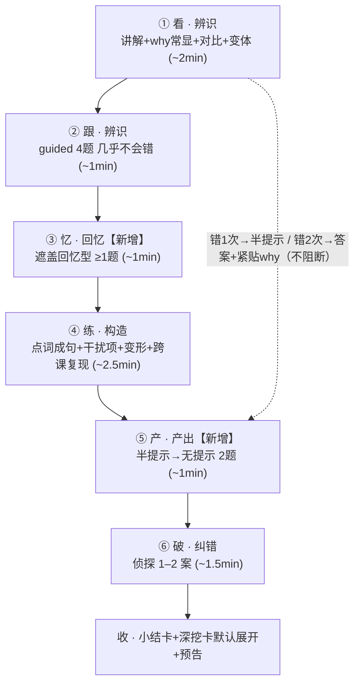

# 功能规格书（PRD）：「小美的一天」深度与训练密度补强

| 元信息 | 内容 |
|---|---|
| 标题 | 单课深度与训练密度补强（模板级改造） |
| 日期 | 2026-09-13 |
| 类型 | PRD（第二轮加深，非首轮建设） |
| 参与成员 | 方向明（主理人）、析客（需求分析，执笔）、瑞思（用户研究）、竞析（竞品分析）、数析（指标评审）、路径（路线图，另见 roadmap-grammar-depth-2026-09-13.md） |
| 前置文档边界 | 早间《语法模块升级 PRD（讲透/理解/复习/熟练掌握）》已交付前测、正误对比揭示卡、小结卡、SM-2 复习。**本 PRD 不重复上述范围**，只解决「单课太短／讲得不够详细／训练方式与内容太少」，聚焦 **20 课共用的课程结构与题型供给**。 |
| 决策门关联 | 第二批（现在完成时拆 3–4 课 + 从句）**必须等本模板定稿后启动**，见 §9。 |

---

## 📌 TL;DR

本轮问题不是"内容不够多"，而是**主线承担了错误的职责**：把"讲清楚"外包给了默认折叠的深挖卡，把"训练"做成了零摩擦的确认动作（practice 一次通过率 100%、2.3–4.6s/题）。
加深＝**把零摩擦步替换为低摩擦需思考步 + 补齐认知层级**（回忆层当前完全缺失），**不是**堆同型点词成句题。
拍板目标：单课有效认知时长 **6–10 分钟**、practice 一次通过率 **70–85%**、output 一次通过率改善到 **30–50%**、每课覆盖 **≥4 认知层级**且产出层 ≥2 题。
范围：只改**模板级**结构与题型（3–5 人日）＋ 20 课数据补可选字段（2–4 人日）＋ 埋点补齐（0.5 人日），零迁移、向后兼容。

---

## 🎯 核心结论卡片

| 维度 | 结论 |
|---|---|
| 推荐方案 | 单课由四段式升级为**六段式**：看→跟→忆→练→产→破，认知层级从 3 层补齐到 5 层 |
| 优先级 | P0：R1–R6、R10–R12、R14–R16、R18、R19、R22；P1：R7–R9、R17、R20、R21、R23；P2：R13（自由写作段，停车） |
| 预期影响 | 单课有效认知时长 2.6min → 6–10min；practice 通过率 100% → 70–85%；认知层级 3 → ≥4；回忆层 0 → ≥1 |
| 资源需求 | 模板/交互 3–5 人日 + 数据补字段 2–4 人日 + 埋点 0.5 人日 ≈ **5.5–9.5 人日** |
| 风险等级 | **中**。主风险：output 已 0/9 一次通过，无节制加深会把"短而不痛"变成"长而痛"，故采用**预算制 + 阶梯提示 + 过渡档**三重降压 |

---

## §1 产品目标

| # | 目标（正交） | 验收信号 |
|---|---|---|
| G1 有效认知时长 | 单课"有摩擦步骤累计"≥2.5min，全课 6–10min（纯"点下一步"不计入） | 埋点测：单课中 ≥2.5min 花费在需思考步；durationMs（修正口径后）落在 360–600s |
| G2 训练摩擦回归 | practice 一次通过率从 100% 降到 **70–85%**；output 一次通过率从 0% 改善到 **30–50%** | 靠干扰项与变式达成，不靠提高难度到挫败；每课"可能出错点"3–5 个且分布在 ≥2 段 |
| G3 认知层级覆盖 | 每课覆盖 **辨识／回忆／构造／产出／纠错 ≥4 层**，产出层 ≥2 题（含 1 题半提示过渡） | 结构校验：每课含 ≥1 道 recall 题、≥1 道半提示产出、"为什么"主线必修 ≥1 处、深挖卡默认展开 |

## §2 用户故事

1. **作为**中文母语成人初学者，**我想**在主线里就听到一句人话讲清"为什么这样说、为什么不是另一种"，**以便**不用主动展开折叠卡才搞懂规则。
2. **作为**时间成本敏感的成人学习者，**我想**在过程中被**卡住 2–3 次且当场被讲明白**，**以便**感到这几分钟真的学到了东西，而不是一路点"下一步"三分钟到终点。
3. **作为**已完成辨识与构造训练的学习者，**我想**在**不给选项**的情况下把中文/场景还原成英文（遮盖回忆型），**以便**检验自己是否真的记住了。
4. **作为**怕被打击的初学者，**我想**在答错时先拿到**半提示**、再错才看答案，且答案紧贴一道"为什么"，**以便**不被挫败感打断、也不设"必须全对才能继续"。
5. **作为**想真正"用出来"的学习者，**我想**在一课结束前有**两档产出**（先给结构提示、再完全无提示），**以便**达成"不看提示也能把新说法用出来"。

## §3 用户研究洞察（瑞思）

三条抱怨共享同一结构原因：**主线没承担"教会"，只承担"过一遍流程"。**

- **「太短」＝缺少需要思考才能通过的步**：全课仅 2 处摩擦（pretest 开头 + output 末尾），中间三段全是"几乎不会错"。反向证据：一道真正需想＋组织＋输出的题能吃掉 **17–110s**，**用户不缺耐心，缺的是值得花时间的步**。体感短根因＝节奏结构（约 7）＋总时长（约 3）。
- **「讲得不够详细」＝"为什么"没进主线**：被塞进默认折叠的深挖卡；主线对比只"告知对错"不"解释成因"。用户主动展开折叠卡是**替代行为**。
- **「训练太少」＝训练集中在单一认知层级**：仅构造（零摩擦）＋少量辨识／产出／纠错，**回忆层完全缺失**。

**一条不可触碰的判据**：「加深不得靠加长同类简单题」——practice 4→8 题同型**不算达标**。

## §4 竞品对比（竞析）

| 产品/单元 | 单课体量 | 题量/构成 | 「为什么」位置 | 摩擦机制（可否借鉴） |
|---|---|---|---|---|
| Busuu 单课 | 3–10min、单焦点 | 10–15 快题，课末 1 题开放写作（≈10%） | 主线 | 显示答案可继续，不阻断 ✅ |
| Duolingo 一课 | 5–10min | 15–17 题 | **折叠**（Tips/Guidebook），被大量用户抱怨"看不到语法" ❌ | 扣心/加题 ❌（违红线） |
| BC 单节语法课 | 估 10–15min | 前测→讲解→后测三段式 | 主线必修 | 前测"故意答错、零惩罚"（与我方同构）✅ |
| Murphy 一单元 | 2 页 | 左页讲解 300–400 词＋4–6 个练习、**30–44 小题**；自由产出占 25–35% | 主线必修（占左页） | 做完对答案，错了回看左页，零阻断 ✅ |
| Rosetta Stone | 20–30min | 100+ 题 | 主线 | **85% 门槛** ❌（违"无卡点"红线） |

**结论**：解释放**主线必修**是行业通例，**唯一折叠的是 Duolingo 且被抱怨**；自由产出放进常规单课有 Busuu 与 Murphy 背书。我方 8 题里 **0 题自由产出**——行业锚点是每课 1–2 题（8–15%），这是最大缺口；但结合红线，本轮以**半提示产出**替代开放式自由写作。

## §5 数据依据（数析）

| 指标 | 实测 | 目标 | 差距 | 判断 |
|---|---|---|---|---|
| 单课完课时长（3 次） | 100.5／231.0／133.9s，均值 **155.1s≈2.6min** | 360–600s | 仅达下限 **43%** | 严重不足 |
| 最完整真实轮次 | L06 **285.7s**／L13 231.0s／L15 142.9s | 360–600s | 最长仍差 **74s** | 不足 |
| guided 一次通过 | ≈95% | 「几乎不会错」 | 符合 | 达标（设计意图） |
| **practice 一次通过** | **20/20 = 100%** | ≥70%（留≤30% 摩擦） | 高出 30pp | **过易、零摩擦** |
| output 一次通过 | free_type **0/9 = 0%** | 30–50% | — | **全课最高摩擦点** |
| pretest contrast 判错 | 4/12 = 33.3% | 未设 | — | 有效教学摩擦 |
| watch contrast 判错 | 1/11 = 9.1% | — | — | 偏易 |
| 深挖卡展开 | 3 次（已玩新课 3/3 全展开，旧课 0） | 「讲透是否被消化」 | 方向支持"想读更多" | 样本小 |
| 侦探破案率 | **无结算埋点，不可测** | ≥70% | — | 需补埋点，0 破案是误读 |

**各段耗时**：practice 4 题合计仅 **9.0–18.2s（2.3–4.6s/题）**；watch L13 段内仅 4.5s；pretest 3.8–10.6s；output 单题 17–110s。**"最薄的是③练"**，其次①看。**体量估算**：达标需 ×1.4–3.9（中位 ×2.2，保守 ×2）。

> **口径陷阱（务必先修）**：① `durationMs` 会被课中重启截断（L06 真实首轮 285.7s，只记了末段 100.5s）；② **ts 完全相同的双发 `grammar_lesson_started`**（React 严格模式双调用 effect；**已修，R22**）；③ 侦探段缺结算埋点（**已修，R19**）；④ output 的 `stepKind` 有 `free_type` / `free_type_hint` 两种口径。

## §6 需求池

### 6.1 课程结构模板改造项

| 编号 | 需求 | 优先级 | 验收标准 | 估算 |
|---|---|---|---|---|
| **R1** | 主线「为什么」前置：正误对比揭示卡内嵌一句零术语 why，**必读不折叠**（`LessonContrast.whyZh` 已存在，改的是呈现：内联常显） | P0 | 对比卡揭晓后 why 文案同屏常显；每课主线必修 why ≥1 处；抽样人工确认"无术语、≤500 词、无挫败字眼" | 0.5–1 人日 |
| **R2** | 深挖卡默认展开：首课展开＋记忆用户偏好；标题改为有信息量的问句 | P0 | 首次进入新课深挖卡为展开态；用户折叠后写入偏好，后续课沿用；旧课回看尊重偏好 | 0.5 人日 |
| **R3** | 正误对比题 4→6–8 题，且**分布到课中 ≥2 个位置**（非集中开头） | P0 | 每课对比判断题 ≥6；≥2 道出现在讲解段之后；分布位点埋点可验证 | 0.5–1 人日 |
| **R4** | practice 加干扰项、单题成本提到 **15–30s**；点词成句占比 ≤1/3 | P0 | 每课 arrange 干扰项 ≥1/题；practice 题均耗时 15–30s；点词成句占比 ≤1/3 | 1–1.5 人日 |
| **R5** | 新增「遮盖回忆型」题（回忆层）：给中文/场景、不给选项 | P0 | 每课 ≥1 道 recall 题；一次通过率 40–70%；计入层级覆盖校验 | 1–1.5 人日 |
| **R6** | 新增「半提示产出」过渡题，置于无提示输出**之前** | P0 | output 段 ≥2 题：第 1 题带结构提示，第 2 题无提示；半提示题一次通过率 ≥70% | 0.5–1 人日 |
| **R7** | 侦探每课提到 **1–2 案**（`huntCaseIds` 已支持多案） | P1 | 每课关联案件 ≥1、目标 1–2；既有 20 课数据不破坏 | 0.5–1 人日 |
| **R8** | 跨课复现题位：练段安插 1 道**上一课**已学句式 | P1 | 从 L02 起每课 ≥1 道复现题 | 0.5–1 人日 |
| **R9** | 变形/替换型题（构造迁移）：换主语/时间/情态 | P1 | 每课 ≥1 道 replace 题；复用 arrange 交互内核 | 1–1.5 人日 |
| **R10** | 六段结构编排与时长预算落地（见 §7） | P0 | 单课六段齐全；各段耗时落入预算区间；有效认知时间 ≥2.5min | 1–1.5 人日 |
| **R11** | output 段 2 题编排（半提示＋无提示） | P0 | 与 R6 联动；output 一次通过率 30–50% | 0.5 人日 |
| **R12** | 阶梯提示：错 1 次给半提示、错 2 次给答案＋紧贴错点的 why；**不阻断、不限次** | P0 | 全课卡住 ≤5 次；两次卡顿之间夹一个必然成功步；无"必须全对才能继续" | 0.5–1 人日 |
| **R13** | EGiU/Busuu 式自由写作段（"关于自己"的真实句子，不判对错只给参考） | **P2（停车）** | 见 §8 Non-goals；待"无批改闭环下收益"验证后再评估 | 待评估（不计入本轮） |

### 6.2 数据字段补全项（20 课，**全部可选、向后兼容、零迁移**）

| 编号 | 需求 | 优先级 | 验收标准 | 估算 |
|---|---|---|---|---|
| **R14** | `recall` 题字段扩展（遮盖回忆型） | P0 | 新字段缺省时旧数据回退旧形态；20 课补字段后类型校验通过 | 0.5–1 人日 |
| **R15** | practice 干扰项字段（由 `tokens` 承载干扰项，显式标注正确序） | P0 | 旧数据无干扰项仍可玩；新数据干扰项被正确校验 | 0.5–1 人日 |
| **R16** | 半提示产出字段（结构提示/词库） | P0 | 字段缺省时回退"1 题无提示产出"；有值时不判对错 | 0.5 人日 |
| **R17** | 复现题位字段（引用前课句式） | P1 | 字段可选；引用失效时自动跳过不报错 | 0.5 人日 |
| **R18** | 向后兼容回归 | P0 | 现有 20 课在**不补任何新字段**下流程完整、无报错；类型与既有测试全绿 | 0.5–1 人日 |

### 6.3 埋点补齐项

| 编号 | 需求 | 优先级 | 验收标准 | 估算 | 状态 |
|---|---|---|---|---|---|
| **R19** | 侦探结算埋点：破案/未破/星数/耗时 | P0 | 每案产生 1 条结算事件；破案率可算 | 0.5 人日 | ✅ **本次已完成** |
| **R20** | 各段停留/深挖消化埋点（段级 dwell） | P1 | 六段各自可算停留时长；深挖展开/读完可区分 | 计入 0.5 人日 | 待做 |
| **R21** | `stepKind` 口径归一（`free_type` / `free_type_hint`） | P1 | 单一枚举；历史数据可映射 | 计入 0.5 人日 | 待做 |
| **R22** | 双发 `started` bug 修复 | P0 | 单次进入只发 1 条 `grammar_lesson_started` | 计入 0.5 人日 | ✅ **本次已完成** |
| **R23** | `durationMs` 截断口径修正（课中重启不丢时长） | P1 | 首轮时长可被正确记录 | 计入 0.5 人日 | 待做 |

> **工作量汇总**：模板/交互（R1–R12）≈ 3–5 人日；数据补字段（R14–R18）≈ 2–4 人日；埋点（R19–R23）＝ 0.5 人日。

## §7 关键流程 / UI 说明

### 改造后单课六段结构（认知层级：辨识→回忆→构造→产出→纠错）

| 段 | 名称 | 认知层级 | 内容 | 时长预算 |
|---|---|---|---|---|
| ① | 看 | 辨识 | 讲解（含 why 常显）＋正误对比揭示＋变体＋场景变奏 | 90–140s |
| ② | 跟 | 辨识 | guided 低风险 4 题（1 choose＋2 arrange＋1 spot） | 50–80s |
| ③ | **忆（新）** | **回忆** | 遮盖回忆型 ≥1 题：给中文/场景、不给选项 | 40–60s |
| ④ | 练 | 构造 | 点词成句（带干扰项，≤1/3）＋变形/替换＋跨课复现 | 100–160s |
| ⑤ | **产（新）** | **产出** | 半提示产出 → 无提示产出（共 2 题） | 50–80s |
| ⑥ | 破 | 纠错 | 侦探 1–2 案＋纠错解析 | 60–110s |
| — | 收 | — | 小结卡＋深挖卡（默认展开）＋下一课预告 | 并入⑥尾 |

**预算校验**：合计 390–630s，与 360–600s 目标区间吻合；护栏：任何 >15s 空档必须有可读/可听内容承接。

**UI 变更要点**：① 对比卡揭晓区新增常显"为什么"文案行 ② 深挖卡默认展开＋折叠偏好持久化 ③ 新增 recall 题渲染（无选项）④ practice 词块区显示干扰项 ⑤ output 第 1 题带句型框/词库 ⑥ 答错走阶梯提示，答案卡紧贴 why。

## §8 Non-goals

- **不做**逐课 20 课内容重写式扩产（那是后续批次）——本轮仅模板级结构改造。
- **不做**自由写作段（R13，P2 停车）：单人自用、无批改闭环时"不判对错"的自由写作收益待验证，且会触碰"未配置 AI"降级路径。
- **不引入**扣血/心数/限时/百分比门槛/排名/体力值（明确避开 Duolingo 扣血与 Rosetta 85% 门槛）。
- **不违背**既有红线：零术语主线、核心 500 词、无挫败性字眼、反低幼、无"必须全对才能继续"。
- **不改动**已落地的首轮范围（前测/对比揭示/小结卡/SM-2）。
- **不以**"加长同类简单题"充当加深（practice 4→8 同型不算达标）。

## §9 时间线 & 里程碑（初步，正式路线图见 roadmap-grammar-depth-2026-09-13.md）

| 里程碑 | 内容 | 依赖 |
|---|---|---|
| M1 模板定稿 | R1–R6、R10–R12、R14–R16 交互与字段方案冻结 | 本 PRD 评审通过 |
| M2 埋点先修 | R19、R22（P0）先行，恢复可测量基线 | 无（R19/R22 **已完成**） |
| M3 数据补字段 | R14–R18 为 20 课补齐，回归测试全绿 | M1 |
| M4 试玩复测 | 对照 §1 三目标复测 | M2、M3 |
| M5 路线图对齐 | 路径产出正式路线图，含第二批排期 | M4 |

> ⚠️ **第二批内容（现在完成时拆 3–4 课 + 从句）待本模板定稿（M1）后再启动**，否则将按旧模板产出 4 课返工。

## §10 待确认问题（需产品负责人拍板）

1. **深挖卡默认展开的默认密度**：首课展开＋记忆偏好 vs 全课一律默认展开？
2. **practice 通过率目标 70–85%**：由"干扰项数量"还是"变式迁移"主导达成？直接决定 R4 与 R9 的权重。
3. **output 半提示档的提示强度**：完整句型框（强）还是仅词库（弱）？影响能否落到 30–50%。
4. **recall 题输入方式**：自选词块（受控）还是自由填词（更接近产出）？
5. **durationMs 口径**：以"修正后可跨重启累计"为准，还是另建"有效认知时长"独立指标？
6. **R13 自由写作段的去留**：确认本轮停车至 P2，还是以小样验证"无批改闭环收益"？

---

## ✅ 行动清单

| # | 行动 | 负责成员 | 前置 | 对应需求 |
|---|---|---|---|---|
| 1 | 冻结六段结构与人话 why 文案规范 | 析客＋方向明 | 本 PRD 评审 | R1、R10 |
| 2 | 先修埋点（侦探结算＋双发 started）恢复基线 | 数析 | 无 | R19、R22 ✅ 已完成 |
| 3 | 实现 recall / 半提示产出 / 干扰项字段与渲染 | 研发 | M1 | R5、R6、R14–R16 |
| 4 | 为 20 课补可选字段并跑向后兼容回归 | 研发＋析客 | M1 | R14–R18 |
| 5 | 试玩复测，对照三目标出对照数据 | 数析＋瑞思 | M3 | G1–G3 |
| 6 | 出正式路线图，锁定第二批启动点 | 路径 | M4 | §9 |

---

## ⚠️ 待确认 / 假设 / Non-goals

- **假设**：`huntCaseIds` 多案能力已就绪（L10 已挂 2 案、L11 已挂 3 案），R7 主要是内容补位而非结构改动。
- **假设**：`LessonContrast.whyZh` 字段已存在（见 `src/types.ts`），R1 属呈现层改动。
- **待确认**：见 §10 六个决策点。
- **Non-goals**：见 §8。

---

## 📚 数据来源 & 成员产出索引

| 来源 | 内容 |
|---|---|
| 用户原话（2026-09-13） | 试玩 L13–L20 后的三条抱怨 |
| 数析 | 指标表（实测 vs 目标）、各段耗时、体量估算、口径陷阱 |
| 瑞思 | 三条抱怨拆解、认知层级清单、10 条体验要求、用户视角验收标准、风险与平衡 |
| 竞析 | 单课体量、题型配比、解释位置、摩擦机制、结构模板建议 |
| 方向明 | 方向性综合与目标口径拍板（目标、范围、优先做/不做、工作量基准） |
| 代码核实 | `src/types.ts`、`src/data/grammarLessons.ts`（20 课、huntCaseIds）、`src/data/huntCases.ts` |

---

> 本报告由产品战略团队 AI 协作生成，重要决策请由产品负责人审定。
