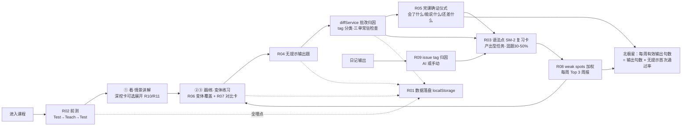

# 听写工坊语法模块升级 PRD · 讲透/理解/复习/熟练掌握

**日期**：2026-09-12｜**类型**：PRD｜**参与成员**：方向明（主理人）、瑞思（用户研究）、竞析（竞品分析）、数析（数据分析）、析客（需求分析）

---

## 📌 TL;DR

12 课讲解内容层已满配，真正的缺口在**训练与闭环系统**：无落盘测量、语法点不进复习队列、无无提示输出验证、无归因回路。本次升级以最小闭环为 P0——补齐数据埋点、BC 式前测、语法点 SM-2 产出型复习卡、无提示输出题型、完课确证仪式——使用户每课能回答「我今天该学哪个点、学完对不对、明天复习什么」。P0+P1 合计约 11.5 人日，符合单人开发约束。所有 AI 功能均配无 AI 降级方案。

---

## 🎯 核心结论卡片

| 项 | 内容 |
|---|---|
| **推荐方案** | 不重写讲解内容，围绕四支柱补齐「前测→讲解→练习→批改归因→SM-2 复习→周报→无提示输出验证」闭环 |
| **优先级** | P0 最小闭环（6.5 人日）→ P1 复习深化与交互升级（5 人日）→ P2 内容增强与可视化（7 人日，按需排期） |
| **预期影响** | 北极星「每周有效输出句数」成熟期 ≥25 句/周且无提示首次通过率 ≥80%；次日复习率 ≥50%；30 天完课 ≥8 课 |
| **资源需求** | 单人开发，P0+P1 约 11.5 人日（8–12 人日区间内）；P2 凭 M1/M2 数据裁决 |
| **风险等级** | 中低——主要风险是「加深=变长=吓退」，已用主线锁 6–10 分钟+深度放可选层规避（瑞思风险①⑤） |

---

## 1. 产品目标（3 个正交目标）

| 目标 | 定义 | 验收信号 |
|---|---|---|
| **G1 确证感** | 学完一课，用户能明确回答「我真的会了吗」，而非靠时长感知进度 | 完课小结卡展开率 ≥50%；practice 完成率 ≥90% |
| **G2 闭环** | 每次错误都流入可执行的下一步：归因 → 进复习队列 → 定期重现 | 错句回收率 ≥70%；错误复发率 <30%；次日复习率 ≥50%、7 日习惯 ≥30% |
| **G3 掌握** | 从「看懂/选对」到「无提示产出」 | 无提示首次通过率 ≥80%；每周有效输出句数成熟期 ≥25 句（北极星 = 输出句数 × 无提示首次通过率） |

三目标正交：G1 管单课体验，G2 管跨天系统，G3 管产出能力终态。任何新需求至少服务其一，否则进停车场。

---

## 2. 用户故事（引用瑞思体验要求编号 ①–⑨）

**US1（阿岚·零基础重启者）**：作为怕术语的初学者，我在每课开头先做 2–3 道前测题，做错也没关系——随后讲解正好解释我错的地方。遇到反例能点开 30 秒解释，不会认为产品教错。〔①②③〕

**US2（阿岚）**：作为讨厌被问答规则的初学者，复习推送给我的是「改对这句」的造句/改错小任务，而不是「请说出三单规则」。〔⑥〕

**US3（小舟·应试学生党）**：作为爱考否定/疑问/例外考点的小舟，我在一个知识点内切换肯定/否定/疑问/复数变体练习，错句与正确句并排对比、先判断再揭示，我知道差在哪。〔④⑤〕

**US4（Ken·职场自学者）**：每次练习自动混入 30–50% 我以前的易错点；完课小结卡写明「你现在可以说/写出哪几个新句子、还差什么」，这是我的价值收据。〔⑦⑧〕

**US5（三人共用）**：我单课 6–10 分钟完成学→练→验闭环；每周收到「本周反复犯的语法错 Top 3」，知道下周该练什么。〔⑨ + 竞析·Grammarly 周报〕

---

## 3. 用户研究洞察（瑞思）

**痛点再定义**：用户说「太短太浅学不懂」，实际抱怨的是三种体验缺失——**确定性**（短≠要更多课时，是缺「确证感」，变体零覆盖时确证天然缺失）、**因果性**（浅≠要更学术，是缺「为什么+边界+辨析」，背规则条文是成人最常见放弃诱因）、**顺序性**（学不懂=讲解顺序错了，先做会错的题再看讲解，productive failure 效优于直接看正确例句）。

**三类画像**：A 阿岚（零基础重启者，怕术语、遇反例无解释会流失）；B 小舟（应试，不信任口诀、爱考否定/疑问/例外）；C Ken（职场自学，恨从头啃体系，完课小结是「价值收据」）。

**9 条可验收体验要求**：讲透=①每条规则有为什么+边界 ②例外 30 秒可点开解释不打断主线；理解=③先做会错的题再看讲解 ④错句正确句并排对比、先判断再揭示 ⑤知识点内切换肯定/否定/疑问/复数变体；复习=⑥复习是造句/改错小任务 ⑦自动混入 30–50% 旧易错点；熟练掌握=⑧完课小结卡（掌握了什么/能说出哪几个新句子/还差什么）⑨单课 6–10 分钟学→练→验闭环。

**5 个设计风险及规避**：①加深=变长=吓退 → 深度放可选层、主线锁 6–10 分钟；②术语伤害零基础 → 白话先行+括号小字给术语；③错句被当正确示范记住 → 先判断再揭示、错句带视觉标记、禁止裸展示错句；④复习变负担 → 每次 ≤10 张卡或 ≤5 分钟、任务模板化、堆积按最旧错题优先截断；⑤课内节奏断裂 → 新元素归属段内固定位置、小结卡承担「回放全课地图」。

---

## 4. 竞品对比（竞析）

| 产品 | 一句话特征 | 对本 PRD 的启示 |
|---|---|---|
| Duolingo | 答后按需「Explain My Answer」，对错都讲，讲解按母语定制 | 启发 R02/R10：三单→「中文动词不变形所以你总忘 -s」 |
| Babbel | 10–15 分钟课内嵌 Grammar Tips + 7/14/30 天 Review Manager | 启发 SM-2 间隔参数与课内深度可选层 |
| Busuu | Smart Review（ELTons 2020）按母语+表现预测难点 | 启发 R14「中文使用者最常错」课卡预告 |
| 剑桥 GIU | 左讲右练、对比单元写进骨架、例句全配音频取自已学词表 | 启发 R07 对比卡、R13 例句配音频 |
| British Council | A1–A2 Test→Teach→Test 三段微课 | 直接启发 R02 前测仪式 |
| GrammarLab（开源） | 六栏卡 + mistake_events 按 concept_tag 记错 + weak spots=频率×新近加权 | **最接近的参照物**，启发 R01/R03/R08 |
| 流利说 A+ | 错题集→强化课→再测闭环（最完整中文产品） | 启发 G2 闭环设计 |
| 英语兔 | 先讲「中文没有的概念」、4×4 矩阵讲 16 时态、但零复习机制 | 启发 R12；警示：无复习=用户自制笔记 |

**空白点**：语法 SRS 行业主流以词汇为主体；输出归因闭环仅 GrammarLab 近邻；从「用户听写输出」出发的定位无直接竞品；新空白 A=前测-确证双测仪式、B=时态互动可视化——R02/R12 即抢占这两点。

**Top 借鉴→需求映射**：GrammarLab 六栏卡/weak spots→R01/R03/R08；Duolingo 答后讲解→R02/R10；BC 前测→R02；Busuu 难点预告→R14；GIU 音频例句→R13；Grammarly 周报→R08。

---

## 5. 数据依据（数析）

**资产盘点（真实数字）**：12 课深度字段 100% 填充（**非缺口**——「讲得浅」痛点更可能出在题量与输出闭环）；词块 36+、例句 48（4/课）、深挖卡 12、引导题 48（choose 12 + arrange 24 + spot 12）、自由练习 36、侦探 12 案 29 错（tag 分布：tense 6 / sv_agreement 5 / plural 5 / article 3 / preposition 3 / missing_be 2 / run_on 2 / word_order 2 / verb_form 1 / **fragment 0**）、词典 12,001 条。

**可测量性缺口**：guided/practice 判题结果内存态不落盘；grammarLessonsDone 无时间戳；深挖/对比/变体展开事件零记录；复习唯一桥接是 addLessonMistakeSentence（仅错句，核心句型不进队列）；reviewService 只认 cardId 无语法点维度；无「无提示输出」场景（日记 DiaryIssue 无 tag 字段无法归因）。

**指标体系**：北极星=每周有效输出句数（分子限定语法课+日记+自由造句）；漏斗=进入语法模块 ≥60%→完课 ≥70%→完成练习 ≥90%→次日复习 ≥50%→7 日习惯 ≥30%；质量=错误复发率 <30%、无提示首次通过率 ≥80%、批改误报率 <20%、深挖卡展开率 ≥50%、30 天完课 ≥8 课、错句回收率 ≥70%。

---

## 6. 需求池

### P0（最小闭环，6.5 人日）

| 编号 | 需求 | 支柱 | 验收标准 | 工作量 |
|---|---|---|---|---|
| R01 | 数据基建 P0 埋点 | 基建 | ①grammar_lesson_completed{lessonId,completedAt,guidedFirstTry,practiceFirstTry,durationMs} ②lesson_step_result{lessonId,section,stepKind,stepIndex,attempts,passed,ts} ③deep_dive_expanded{lessonId,ts} ④hunt_not_error_click 补记 verdictKind ⑤diary_issue_tag（DiaryIssue 加可选 tag 字段）落盘 localStorage，刷新后可查 | 1.5 |
| R02 | BC 式前测仪式（Test→Teach→Test） | 讲透 | 每课第①段前插入 2–3 道前测题（复用引导题变体）；前测做错→讲解正常进行且小结卡注明「前测错的 X 点本课已覆盖」；前测全对→提示可跳读讲解但练习不跳过 | 1 |
| R03 | 语法点 SM-2 产出型复习卡 | 复习 | reviewService 扩展 grammarTag 维度；核心句型+错句均入队；复习卡为改错/填空/重组产出型小任务（非答规则）；每次 ≤10 卡或 ≤5 分钟；新错+旧错混题 30–50%；堆积按最旧错题优先截断；次日复习率 ≥50% | 2 |
| R04 | 无提示输出题型 | 熟练掌握 | 每课练习段末尾 1–2 题：隐藏中文句意提示，仅给场景说明，用户整句输出后 diffService 批改；记 practiceFirstTry 无提示口径；三单 -s 为常驻检查项；每课至少覆盖 1 题 | 1 |
| R05 | 完课确证仪式 | 熟练掌握 | 小结卡升级三段：✅掌握了什么（知识点清单）／🗣️你现在能说出/写出哪几个新句（列本课核心句）／⚠️还差什么（本课错题对应点+已入复习队列提示）；错题点自动附「明天复习见」链接 | 1 |

**规格说明**：R01 全部埋点写入 localStorage 独立键空间，不改动现有服务接口；R02 前测题不判分不排名（约束：不限时排名），做错不打击——文案固定「错了正好，这课就是讲它的」；R03 复用 SM-2 Schedule 结构仅新增 tag 字段，卡片模板三选一（改错/填空/重组）随机轮换防止背答案；R04 无提示题失败不阻断完课，自动归入 R03 队列；R05 小结卡在本课 summary 字段基础上渲染，不新增内容维护负担。

### P1（复习深化与交互升级，5 人日）

| 编号 | 需求 | 支柱 | 验收标准 | 工作量 |
|---|---|---|---|---|
| R06 | 内容扩量：变体覆盖+案件补齐 | 理解 | 每知识点练习题覆盖 ≥3 变体（肯定/否定/疑问/复数中至少 3 种）；fragment 罪名从 0 补至 ≥3 题；侦探案件扩至 ≥20 案（≥50 错），10 类罪名每类 ≥3 题 | 2 |
| R07 | 对比卡「先判断再揭示」 | 理解 | contrast 交互升级：先展示双句让用户判断哪句正确→揭示答案；错句带红色斜线视觉标记，禁止裸展示错句；判断正确率纳入 lesson_step_result | 1 |
| R08 | weak spots 加权 + 错误类别周报 | 复习 | weak spots = 频率×新近加权排序（参照 GrammarLab）；每周一展示「本周反复犯的语法错 Top 3」（错误类别+例句+复习入口）；Top 3 可一键加入当日复习 | 1.5 |
| R09 | 日记归因闭环 | 熟练掌握 | AI 批改 prompt 顺带输出 10 类罪名之一写入 DiaryIssue.tag；无 AI 降级：用户手动从 10 类下拉选择或跳过；带 tag 的日记错误按 R03 规则入复习队列 | 0.5 |

**规格说明**：R06 扩量优先用现有 tag 分布反推薄弱类型（fragment/word_order/verb_form 最缺）；R07 遵守瑞思风险③——先判断再揭示是硬性交互顺序；R08 周报数据全部来自 R01 落盘，无 AI 依赖；R09 是 R01⑤ 的视图层闭环，AI 不可用时功能降级不消失。

### P2（内容增强与可视化，约 7 人日，按需排期）

| 编号 | 需求 | 支柱 | 验收标准 | 工作量 |
|---|---|---|---|---|
| R10 | 母语定制解释进深挖卡 | 讲透 | 深挖卡增补「中文负迁移」小节（白话先行+括号小字术语）；每课 ≥1 条，如三单→「中文动词不变形所以你总忘 -s」 | 1.5 |
| R11 | FAQ 卡（例外 30 秒解释） | 讲透 | 深挖卡支持 FAQ 折叠条目：遇反例时 30 秒可读解释，不跳离主线；展开事件记录 | 1.5 |
| R12 | 时态 4×4 矩阵可视化 | 理解 | 时间×状态 4×4 交互矩阵（参照英语兔），当前课相关格高亮；例句配发音（复用 SpeakButton） | 2 |
| R13 | 例句全配音频 | 理解 | 12 课 48 例句全部可点读，例句取自核心 500 词教学规范内 | 1 |
| R14 | 「中文使用者最常错」课卡预告 | 讲透 | 每课卡封面展示 1 条母语者高频错误预告（数据来自 R01/R08 真实错题或预置话术） | 0.5 |
| R15 | can-do 能力徽记体系 | 熟练掌握 | 按完课小结累积 can-do 清单（「我能用一般过去时描述昨天」），达成条件与无提示首次通过率挂钩 | 0.5+ |

---

## 7. 关键流程图（升级后的学习闭环）

---

## 8. Non-goals（明确不做什么）

| 不做什么 | 理由 |
|---|---|
| 不重写 12 课讲解内容、不新增课时 | 数析证实深度字段 100% 填充，缺口在闭环不在内容；拆课违拍板约束 |
| 不拆课、不题海、不限时排名 | 已拍板约束；题海与确证感负相关（瑞思洞察一） |
| 不建立系统化术语教学体系 | 瑞思风险②：术语伤害零基础；深挖层可含术语但须自含解释 |
| 不做语法规则查询手册/独立词典界面 | 词典 12,001 条已可用；与「训练闭环」定位无关 |
| 不做多用户、云同步、社交排名 | 产品自用验证阶段（单人），成本不匹配 |
| 不做语音识别口语评分 | SpeakButton 已覆盖发音输入；识别评分超出 8–12 人日预算 |
| 不做 AI 生成课程的实时个性化课表 | AI Provider 为可选依赖，所有 AI 功能仅限批改/归因且有降级方案 |
| 不在 v1 做每周有效输出句数的自动统计面板 | 北极星数据靠 R01 埋点先行积累，面板 P2 后评估 |

---

## 9. 时间线 & 里程碑（单人开发）

| 阶段 | 时间窗 | 交付物 | 验证指标 |
|---|---|---|---|
| **M1 · P0 最小闭环** | 第 1 周（6.5 人日） | R01 埋点上线、R02 前测、R03 复习卡、R04 无提示题、R05 确证仪式 | 埋点全量落盘；次日复习率 ≥50%；完课率 ≥70% |
| **M2 · P1 复习深化** | 第 2 周（5 人日） | R06 内容扩量、R07 对比卡、R08 周报、R09 日记归因 | 错误复发率 <30%；错句回收率 ≥70%；深挖展开率 ≥50% |
| **M3 · P2 按需增强** | 第 3–4 周 | R10–R15 按需挑选 | 无提示首次通过率 ≥80%；北极星趋势观察 |

M1 结束即可独立回答「今天学哪个点（前测+课卡预告）、学完对不对（确证仪式）、明天复习什么（SM-2 队列）」。

---

## 10. 待确认问题

1. **前测错题是否直接入复习队列**，还是等练习确认后再入？前者召回快但可能噪声大，影响混题质量。
2. **R08 周报入口位置**：语法模块内 vs 首页卡片？影响 7 日复习习惯漏斗（≥30%）的触达。
3. **R06 案件扩容（12→≥20 案）由谁产出**：手工撰写 vs AI 生成初稿+人工校验？涉及内容质量红线与工时分配。
4. **DiaryIssue 的 10 类罪名枚举与 huntService tag 是否完全对齐**？若不对齐需建映射表，R09 工作量会上浮。
5. **R15 can-do 徽记的达成阈值**：直接复用北极星「无提示首次通过率 ≥80%」口径，还是按课粒度放宽到 ≥60%？

---

## ✅ 行动清单

| # | 行动 | 负责方 | 时间窗 |
|---|---|---|---|
| 1 | 确认待确认问题 1–5（尤其前测错题入队策略与案件扩容方式） | 方向明 | M1 启动前 |
| 2 | R01 五个埋点落地并自测落盘 | 析客→开发 | M1 第 1–2 天 |
| 3 | R02+R05 前测与确证仪式接入四段式骨架 | 开发 | M1 第 3–5 天 |
| 4 | R03 reviewService 扩展 grammarTag + 复习卡模板 | 开发 | M1 第 5–7 天 |
| 5 | R04 无提示题 + R06 内容扩量 | 开发 | M2 |
| 6 | R08/R09 归因与周报 | 开发 | M2 |
| 7 | P2 需求按 M1/M2 数据表现决定取舍 | 方向明 | M2 结束后 |

## ⚠️ 待确认 / 假设

- 假设：M1 开发期间不重构 lessonService 现有判题逻辑，埋点以旁路记录实现（若需侵入改动，R01 工作量 +0.5 人日）。
- 假设：R02 前测题全部复用现有引导题库变体，不新写题干（否则 +0.5 人日）。
- 假设：北极星分子（输出句数）统计范围在本期仅覆盖语法课+日记，自由造句场景待 P2。
- P2 合计约 7 人日，超出 8–12 人日预算范围，默认全部延后，M2 结束后凭数据裁决。

## 📚 数据来源 & 成员产出索引

- **方向明（主理人）**：升级总诉求与方向性要求（训练闭环优先、四支柱组织、P0 最小闭环定义、工作量约束）。
- **瑞思（用户研究）**：第 2 节用户故事、第 3 节全部洞察（痛点再定义、三类画像、9 条体验要求、5 个设计风险）。
- **竞析（竞品分析）**：第 4 节全部内容（8 产品对比、空白点验证、Top 借鉴→需求映射）；R02/R08/R10/R12/R14 直接源于竞品手法。
- **数析（数据分析）**：第 5 节全部数据（资产盘点、可测量性缺口、指标体系）；R01 五埋点清单、R06 扩量方向（fragment 0 题）、北极星口径。
- **析客（需求分析）**：需求池编制与优先级、工作量估算、验收标准、Non-goals、时间线、待确认问题。

---

> 本报告由产品战略团队 AI 协作生成，重要决策请由产品负责人审定。
