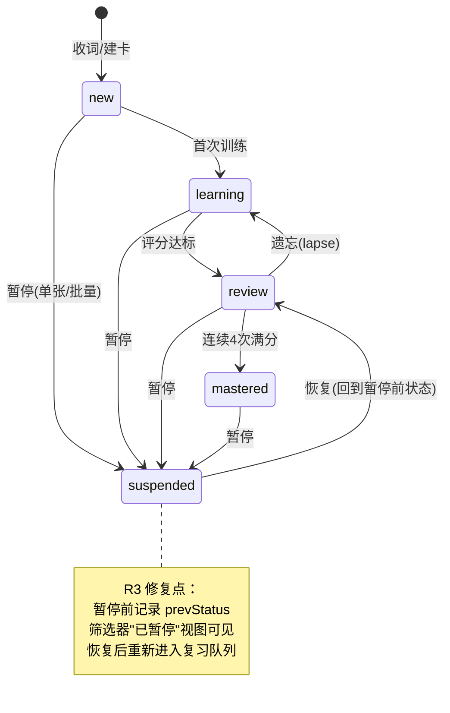

# 词库板块优化 · 功能规格书（PRD + 竞品分析 + 路线图）

**日期**：2026-09-13
**类型**：PRD（含竞品分析与路线图更新）
**参与成员**：析客（需求分析师）、瑞思（用户研究员）、竞析（竞品分析师）、数析（数据分析师）、路径（路线图规划师）
**范围**：/library 词库板块（`src/pages/LibraryPage.tsx`）及其与训练、复习、材料、词书单元的联动

---

## 📌 TL;DR（执行摘要）

- **核心目标**：让词库板块"数据诚实、闭环完整、差异化生根"——修复 4 个高危 UX/口径问题（暂停黑洞、120 条静默截断、到期口径稀释、训练断链），打通"回顾→定向训练"闭环，把"来源追溯"做成一等公民。
- **关键决策**：P0 全部给数据正确性与高危 UX（约 7 人日），先于任何新功能；差异化采纳"来源追溯双向导航"与"我的材料组织维度"两条，AI 制卡与云同步明确不做。
- **下一步**：按 3 个双周 Sprint 执行（S1 数据诚实 → S2 闭环打通 → S3 差异化），总投入约 16-20 人日；§10 有 5 个待拍板问题（AI 立项、新卡入口、"系统关注"可解除性、材料批量操作、欧路应对节奏）。

---

## 🎯 核心结论卡片

| 项目 | 内容 |
|------|------|
| 推荐方案 | 三 Sprint 渐进优化：S1 修复数据正确性与高危 UX（P0×4），S2 打通定向训练与指标口径（P1×5），S3 落地差异化与健康度面板（P2×4） |
| 优先级 | P0：R1 到期口径、R2 列表诚实化、R3 暂停生命周期、R4 搜索性能、R5 训练闭环（详见 §6） |
| 预期影响 | 到期/薄弱/重点数字可解释；批量操作零误导；"回顾→练这张卡"从 5+ 步缩到 2 步；形成竞品无人做到的卡片↔材料双向追溯 |
| 资源需求 | 单开发者约 16-20 前端人日，6 周（3 个双周迭代） |
| 风险等级 | 中（主要风险：reviewService 口径改动的连锁影响面、训练页参数化改造回归） |

---

## 1. 产品目标（析客）

本次词库板块优化聚焦三个正交目标：

1. **数据诚实**：词库的每一个数字、每一个列表、每一次批量操作都如实反映真实数据——到期口径正确、列表不静默截断、批量操作范围可预期。这是信任基础，先于一切新功能。
2. **闭环打通**：打通"回顾→定向训练"与"暂停→恢复"两条断裂的生命周期，让词库从"只读档案柜"变成记忆系统的中枢节点。
3. **差异化生根**：把竞品无人做到的"来源追溯"做成一等公民（卡片↔材料双向导航），巩固"围绕真实语境的个人记忆系统"这一定位。

---

## 2. 用户故事（析客）

**故事 1：找回消失的暂停卡（源自瑞思问题 1）**
林晚两周前暂停了 30 张与当前考试无关的卡片，应用提示"数据会保留"。今天她想恢复它们，但筛选器里没有"已暂停"选项，搜索也搜不到——卡片从所有视图蒸发了。她期望：筛选器有"已暂停"入口，选中后看到全部暂停卡，可以单张或批量恢复，恢复后卡片回到暂停前的学习状态并重新进入复习队列。

**故事 2：一次不被误导的批量删除（源自瑞思问题 2）**
陈默筛选出"短语"标签下 480 张卡片，点了"全选当前"准备删除其中低价值的。他以为选中的是 480 张，实际只有前 120 张（`visibleItems.slice(0,120)`，LibraryPage.tsx:213），且界面无任何提示。他期望：列表顶部始终显示"共 480 条，已加载 120 条"，"全选"默认选中所有匹配项，批量删除前弹出明确范围确认。

**故事 3：从回顾直达定向训练（源自瑞思问题 4）**
阿澜在词库详情里看到 ephemeral 这张卡已经错了 4 次，点"进入训练"，却被丢进全局拼写训练队列，要练完全无关的词才可能轮到它。她期望：详情页的训练按钮携带 cardId，直接进入只包含该卡（或当前筛选集）的定向训练，练完回到详情页并看到最新复习记录。

**故事 4：找回本周新收录的词（源自瑞思问题 6）**
老周这周从读的小说里收集了 25 个生词，周末想集中过一遍。但词库按 priority+updatedAt 排序，新词淹没在 800 张旧卡中，无处可找。他期望：有"最近收录"视图，按收录时间倒序，可按"今天/本周/本月"过滤。

**故事 5：看懂自己的词库健康度（源自数析 P2 + 瑞思洞察区）**
苏苏想知道自己的词库是不是"只进不出"：积压了多少到期没复习的、有多少来源材料还没产出卡片。她期望：洞察区有一屏健康度面板，展示积压率、暂停率、来源覆盖率、近 14 天遗忘率四个指标，点击任一指标可跳转到对应过滤列表。

---

## 3. 用户研究洞察（瑞思）

| # | 严重度 | 问题 | 依据 |
|---|--------|------|------|
| 1 | 高 | 暂停=黑洞：`activeCards` 直接过滤 suspended，筛选器无"已暂停"项，暂停卡不可见、不可恢复，与"数据会保留"文案矛盾 | LibraryPage.tsx:132 |
| 2 | 高 | 120 条静默截断 + 全选误导：`slice(0,120)` 无提示，"全选当前"只选可见 120 条，批量删除/暂停范围被误解 | LibraryPage.tsx:213 |
| 3 | 高 | 搜索性能 O(n²)：filteredItems 循环内逐卡调用 getWordDetails/getSentenceDetails（数组 find），每击键全量重算 | LibraryPage.tsx filteredItems 逻辑 |
| 4 | 高 | "进入训练"丢上下文：详情主 CTA 是不带 cardId 的 /spelling、/review 链接，回顾→定向练闭环断裂 | LibraryPage.tsx:619-621, 724 |
| 5 | 中 | 撤销仅一步且 toast 常驻，用户分不清还能否撤销 | 批量管理 toast 逻辑 |
| 6 | 中 | 无"最近添加"时间维度，新词淹没（列表按 priority+updatedAt 排序） | LibraryPage.tsx 排序逻辑 |
| 7 | 中 | 短语卡片无任何编辑入口（`canDeepEdit = type!=="phrase"`），只能删除重建 | LibraryPage.tsx:620 |
| 8 | 中 | 材料与卡片混排、材料不可批量操作 | LibraryPage.tsx 列表渲染 |
| 9 | 中 | 空状态不分场景（词库空 vs 搜索无结果共用同一文案） | LibraryPage.tsx 空状态渲染 |

**用户旅程断点**：收集（/add、/import 有成就感）→ 沉淀（无"新收录"反馈，新词淹没）→ 检索（搜索维度丰富但大词库卡顿）→ 管理（撤销给人安全感，但暂停后卡片彻底消失）→ 回流（"进入训练"丢上下文，想练的卡练不到）。

---

## 4. 竞品对比（竞析，2026 现状已核实）

**词库管理维度对比矩阵：**

| 维度 | Anki 25.x | 墨墨 | 不背单词 | 欧路 | 有道 | 本产品（现状） |
|------|-----------|------|----------|------|------|----------------|
| 检索/筛选 | 强（浏览器表达式） | 中 | 弱 | 中 | 中 | 中（搜索+7 类筛选，但 O(n²) 且截断） |
| 批量管理 | 强 | 弱 | 弱 | 中 | 中（批量编辑） | 中（有批量+撤销一步，但范围误导） |
| 暂停/恢复生命周期 | 完整（suspend/bury） | 弱 | 无 | 弱 | 无 | **断裂（暂停即消失）** |
| 来源语境追溯 | 无 | 无 | 例句库（非用户语境） | 生词↔Epub（2025 新上线，单向） | 无 | **有 sourceId 但未做双向导航** |
| 错误回流 | 无分级 | 仅错词列表 | 仅错词列表 | 无 | 无 | 有 lapseCount/错误记录，未闭环到定向训练 |
| 数据主权 | 完全自有（插件生态） | 锁定+600 词上限+买断 | 导出需"导出券" | 云同步 | 云同步+XML 备份 | 完全自有+CSV 导出 |
| 复习算法 | FSRS 默认 | 自研 | 自研 | 弱 | 弱 | 自研 SM-2 变体（口径有缺陷，见 §5） |

**结论**：词库管理单项上 Anki 全面领先但无语境；墨墨/不背在数据主权上有原罪；欧路的 Epub 阅读模块正在逼近"材料→生词"链路，是最接近的威胁。"收词—管理—复习"一体化仍是市场空档（Language Reactor/Trancy 验证了语境收词需求，但复习环节导流 Anki）。

**差异化机会（采纳 2 条）：**
- ✅ **来源追溯作为一等公民**（卡片↔材料双向导航，无人做到）→ R9，进 P1
- ✅ **"我的材料"作为组织维度**（"这本书里我还没掌握的词"）→ R14，进 P2
- ⏸️ 错误回流分级（部分被 R5 覆盖）、AI 补内容短板（转入 §10 待确认）

---

## 5. 数据依据（数析）

| # | 事实 | 影响 | 依据 |
|---|------|------|------|
| D1 | 到期口径稀释：`createInitialSchedule` 把 nextReviewAt 设为 now，所有新卡立即算到期；mastered 不排除；排序内层 `schedules.find` 为 O(n²) | "到期"数字虚高，用户被误导 | reviewService.ts:33, 40 |
| D2 | 重点口径混淆：priority 会被算法自动置位（lapseCount≥3），手动标星与系统提升混在一个数 | "重点"列表语义不清 | reviewService.ts:323 |
| D3 | 薄弱/错词终身累计无时间衰减，而 getWeakCardInsights 排序已用 14 天窗口——计数与排序口径不一致 | 同一列表两个口径，数字不可信 | reviewService.ts:67-69 |
| D4 | learning 是死状态（applyReview 只写 review/mastered）；"本周掌握"用 updatedAt 近似，会被改单元/标重点污染 | 状态机不完整，统计失真 | reviewService.ts:322 |

**决策依据**：数据正确性问题先于新功能——P0 拆到期口径 + 去 120 截断误导；P1 薄弱/错词加 14 天时间衰减；P2 词库健康度一屏（积压率/暂停率/来源覆盖率/遗忘率均可零埋点计算）。

---

## 6. 需求池（析客）

### P0（数据正确性与高危 UX，先于一切新功能）

| 编号 | 需求 | 来源 | 验收标准 | 工作量 |
|------|------|------|----------|--------|
| R1 | 修正到期口径：新卡不再立即算到期，到期列表排除 mastered；消除排序内层 find 的 O(n²)（预构建 cardId→schedule Map） | 数析 D1 | 新建一张卡后"到期"筛选计数不变；mastered 卡不出现在到期列表；1000 卡下到期列表计算 <16ms | 1d |
| R2 | 列表诚实化：移除 120 条静默截断（加载更多/虚拟滚动）；常驻"共 N 条匹配"；"全选"选中所有匹配项；批量删除/暂停前弹出含确切数量的范围确认 | 瑞思问题 2 / 数析 P0 | 筛选出 480 条时显示"共 480 条"；全选显示"已选 480 条"；批量删除弹"将删除 480 张卡片"确认且可撤销 | 2d |
| R3 | 暂停生命周期闭环：筛选器新增"已暂停"；暂停卡可见；详情与批量栏提供"恢复"，恢复后回到暂停前状态并重新进入复习队列 | 瑞思问题 1 | 暂停→筛选"已暂停"→可见→恢复→状态回到原值并出现在"全部"列表；批量恢复同样生效 | 1d |
| R4 | 搜索性能优化：预构建 cardId→details 索引 Map，filteredItems 从 O(n²) 降为 O(n)；输入防抖 | 瑞思问题 3 | 1000 卡下连续输入 10 字符，每次击键到列表更新 <100ms | 1d |
| R5 | 训练闭环带 cardId：详情"进入训练"跳转 `/spelling?cardId=xxx` 或 `/review?cardId=xxx`，训练页支持单卡定向模式，完成后返回详情并刷新复习记录 | 瑞思问题 4 | 从卡 A 详情点"进入训练"→只出卡 A→提交评分后返回详情→显示最新 reviewCount/nextReviewAt | 2d |

### P1（闭环与差异化）

| 编号 | 需求 | 来源 | 验收标准 | 工作量 |
|------|------|------|----------|--------|
| R6 | 薄弱/错词口径统一：计数与排序均采用 14 天滑动窗口（终身累计保留为次要字段） | 数析 D3 | 15 天前的错误不再计入薄弱词计数；洞察区列表与计数完全一致 | 1d |
| R7 | 修复 learning 死状态 + "本周掌握"口径：applyReview 支持 learning 中间态；"本周掌握"改用状态变更事件时间戳 | 数析 D4 | 连续两次高评分未达 mastered 阈值的卡状态为 learning；改单元/标重点不影响"本周掌握"计数 | 1d |
| R8 | "最近收录"视图：按 createdAt 倒序，支持今天/本周/本月快捷过滤 | 瑞思问题 6 | 筛选器出现"最近收录"；选"本周"仅显示近 7 天创建的卡，按时间倒序 | 1d |
| R9 | 来源追溯双向导航：卡片详情"来源语境"可跳转材料页对应 segment 并高亮；材料页 segment 展示"已生成 N 张卡片"并可跳转词库按 sourceId 过滤 | 竞析差异化① | 从卡 A 详情点来源→材料页定位段落并高亮；从材料段落点"查看卡片"→词库显示该材料全部衍生卡 | 2d |
| R10 | 撤销体验明确化：toast 显示"可撤销（1 步）"，新操作或撤销后自动消失；空状态分场景（词库空引导收词/搜索无结果提示调整条件） | 瑞思问题 5、9 | 批量暂停后 toast 显示"已暂停 5 张 · 撤销（剩 1 步）"；撤销后消失；两种空状态文案不同 | 0.5d |

### P2（组织维度与健康度）

| 编号 | 需求 | 来源 | 验收标准 | 工作量 |
|------|------|------|----------|--------|
| R11 | 词库健康度一屏：洞察区新增面板，展示积压率、暂停率、来源覆盖率、近 14 天遗忘率（零埋点可算）；点击指标跳转对应过滤列表 | 数析 P2 / 故事 5 | 4 个指标与手工核算一致；点击"积压率"跳转到期过滤列表 | 2d |
| R12 | 重点口径拆分："我的重点"（手动标星）与"系统关注"（lapseCount≥3）分为两个数/两个筛选项，详情页标注提升原因 | 数析 D2 | 筛选器出现两项；手动标星只在"我的重点"；lapseCount≥3 标注"因多次遗忘被系统关注" | 1d |
| R13 | 短语卡片编辑入口：canDeepEdit 覆盖 phrase，可编辑释义/语境/标签 | 瑞思问题 7 | 短语卡详情出现"编辑"，修改保存后列表即时刷新 | 1d |
| R14 | "我的材料"组织维度：材料列表展示每份材料卡片掌握度（mastered/总数），支持"查看未掌握词"一键过滤 | 竞析差异化③ | 材料页每行显示"掌握 12/45"；点击"未掌握"跳转该材料 status≠mastered 的卡 | 2d |

**工作量合计**：P0 7d，P1 7.5d，P2 6d，共约 20.5 前端人日。

---

## 7. 关键流程图 / UI 设计说明（析客）

### a. 暂停—恢复生命周期状态流转



### b. 回顾详情 → 定向训练闭环

```mermaid
flowchart LR
    A[词库列表] -->|点击卡片| B[卡片详情面板]
    B -->|查看来源语境 R9| C[材料页 segment 高亮]
    C -->|查看衍生卡片| A
    B -->|进入训练 带cardId R5| D{type?}
    D -->|word| E[/spelling?cardId=X]
    D -->|sentence/phrase| F[/review?cardId=X]
    E --> G[定向训练: 仅该卡/当前筛选集]
    F --> G
    G -->|提交评分 applyReview| H[schedule 更新/状态流转]
    H -->|返回并刷新| B
```

### UI 改动要点

1. **筛选器栏**：7 类扩展为 9 类——新增"已暂停"（R3）、"最近收录"（R8）；"重点"拆为"我的重点/系统关注"（R12）；右侧常驻 `共 N 条` 计数（R2）。
2. **列表区**：虚拟滚动/加载更多，移除 120 截断；表头"共 N 条匹配 · 已选 M 条"；全选选中所有匹配项（R2）。
3. **批量操作栏**：标重点/暂停/恢复/删除/导出/归单元；"恢复"仅在选中集含 suspended 卡时出现（R3）；删除/暂停弹范围确认（R2、R10）。
4. **卡片详情面板**："进入训练"带 cardId（R5）；"来源语境"可点击跳转（R9）；暂停卡显示徽标+"恢复"主按钮（R3）；lapseCount≥3 显示"系统关注"（R12）；短语卡开放"编辑"（R13）。
5. **洞察区**：新增"词库健康度"四指标卡（R11）；"薄弱词/最近错误"口径统一为 14 天窗口（R6）。

---

## 8. Non-goals（析客）

| 不做项 | 理由 |
|--------|------|
| 云同步 / 多端 | 单用户桌面应用是既定定位，数据主权恰是差异化；云同步引入账号体系与冲突合并，工程量与本期目标不成比例 |
| 官方词库 / 内容生态 | 与"从真实语境收词"的心智冲突；欧路/墨墨已重兵把守 |
| 社区 / 分享 / 牌组市场 | Anki 生态已覆盖；与单用户隐私定位矛盾 |
| AI 制卡 / AI 内容生成大改版 | 涉及本地/云端 AI 路线决策与成本，单独立项评估（见 §10） |
| 复习算法整体替换（如迁 FSRS） | 本期只修口径缺陷，不换算法内核；替换需数据迁移与回归验证，独立排期 |
| 移动端 | 桌面应用定位不变 |

---

## 9. 时间线 & 里程碑（路径）

**关键路径论证**：P0 的本质是数据与口径正确性，P1/P2 是在正确数据上建闭环与差异化——指标可信是一切衡量指标的前提，搜索索引是后续一切列表功能的技术底座，故 Sprint 1 入口准出 = P0 全部合入且 reviewService 口径有单测覆盖。

| 迭代 | 主题 | 关键交付 | 风险 | 衡量指标 |
|------|------|----------|------|----------|
| Sprint 1（W1-W2，5d） | 数据诚实与口径正确 | R4 搜索索引（最先做）、R3 暂停生命周期、R2 列表诚实化、R1 到期口径拆分 + reviewService 单测 | 口径改动影响 TodayPage/StatsPage，改前 grep 全部调用点 | 到期积压率口径确立（新卡/真逾期分列）；列表操作零静默丢失。**里程碑 M1：列表所见即所得，到期数字可解释** |
| Sprint 2（W3-W4，5d） | 闭环打通与指标可信 | R5 定向训练闭环（cardId 为可选参数，默认路径行为不变）、R6 14 天衰减窗口、R12 重点口径拆分、R8 最近收录 | 训练页被多入口复用，需全入口冒烟 | 从详情发起训练 ≤2 步；薄弱词与真实遗忘行为一致。**里程碑 M2：单卡闭环跑通** |
| Sprint 3（W5-W6，6d） | 差异化与规模化 | R9 来源追溯双向导航、R11 健康度面板、R10 撤销升级、R13 短语编辑 | 来源字段覆盖率不足导致追溯断链 | 健康度四指标可视：积压率↓、来源覆盖率↑、遗忘率↓趋势。**里程碑 M3：差异化能力上线** |

**明确移出本周期**：R14（材料维度筛选）建议在健康度面板显示"来源覆盖率"后再决策；AI 释义需先评估 aiService.ts 现状，作为 Sprint 4 候选。

**风险控制**：取消截断后优先落地"加载更多"而非虚拟滚动（避免过度工程）；Sprint 1 严禁夹带顺手优化；如需压缩到 4 周，唯一可砍项是 Sprint 3 的 R10/R13（共 1.5d），不动 P0/P1。

---

## ✅ 行动清单

| # | 行动 | 负责方 | 时间窗 |
|---|------|--------|--------|
| 1 | Sprint 1 开工：R4 搜索索引 + R3 暂停生命周期并行启动，R2/R1 跟进；reviewService 口径改动前 grep 全部消费点（TodayPage/StatsPage/MistakeBookPage）并补单测 | 开发（本人） | W1-W2 |
| 2 | 拍板 §10 待确认问题 1-3（AI 立项、新卡首次学习入口、"系统关注"可解除性）——其中问题 2 阻塞 R5 的队列设计，需在 Sprint 2 开工前定 | 产品负责人（本人） | W1 内 |
| 3 | Sprint 2：R5 训练页参数化改造（cardId 可选参数），全入口冒烟；R6/R12/R8 跟进 | 开发（本人） | W3-W4 |
| 4 | Sprint 3：R9 来源追溯 + R11 健康度面板上线，验证四指标趋势 | 开发（本人） | W5-W6 |
| 5 | M3 后复盘：用健康度面板数据决策 R14（材料维度）与 AI 释义是否进 Sprint 4 | 产品负责人（本人） | W7 |

---

## ⚠️ 待确认 / 假设 / Non-goals

**待确认问题（请产品负责人拍板）：**
1. **AI 补内容短板是否立项**：本地/可选云端 AI 生成英英释义/搭配/助记，作为对欧路 Epub 进攻的防守。是否同意单独立项做技术预研？
2. **新卡到期口径的产品语义**：R1 修正后新卡默认"不进入到期"，首次学习入口是什么——手动发起首次训练，还是每日队列自动混入 N 张新卡（Anki 的 New cards/day）？**阻塞 R5 队列设计**。
3. **"系统关注"是否可解除**：lapseCount≥3 自动置位后用户能否手动移除？移除后继续遗忘是否再次自动置位？
4. **材料批量操作是否对齐**：本期只做了 R9/R14 的导航与组织维度，材料的批量删除/归组排下一期，还是接受"材料仅单条管理"？
5. **欧路 Epub 模块应对节奏**：是否在下一版本把"材料导入体验"（Epub/网页剪藏）提上路线，还是继续观望？

**关键假设**：单开发者、双周迭代节奏；卡片量级在数千以内（"加载更多"够用，虚拟滚动按需升级）。

**Non-goals**：见 §8（云同步、官方词库、社区、AI 大改版、算法替换、移动端均不做）。

---

## 📚 数据来源 & 成员产出索引

- **析客（需求分析师）**：PRD 正文——产品目标、用户故事、需求池 R1-R14（含验收标准与工作量）、流程图、Non-goals、待确认问题
- **瑞思（用户研究员）**：用户旅程地图（收集→沉淀→检索→管理→回流）+ 9 条 UX 问题清单（4 高 5 中）+ 5 条改进假设
- **竞析（竞品分析师）**：7 家竞品（Anki/墨墨/不背/欧路/有道/Quizlet/LR·Trancy）功能对比矩阵 + SWOT + 5 条差异化机会（2026 现状均已核实）
- **数析（数据分析师）**：5 个现有指标口径审计（D1-D4，附 file:line）+ 词库健康度指标框架（零埋点可算 8 项）+ 3 条优先级决策依据
- **路径（路线图规划师）**：3 Sprint 排期与关键路径论证 + 风险依赖清单 + 版本发布说明要点（总工期 6 周约 16-20 人日）

---

> 本报告由产品战略团队 AI 协作生成，重要决策请由产品负责人审定。
